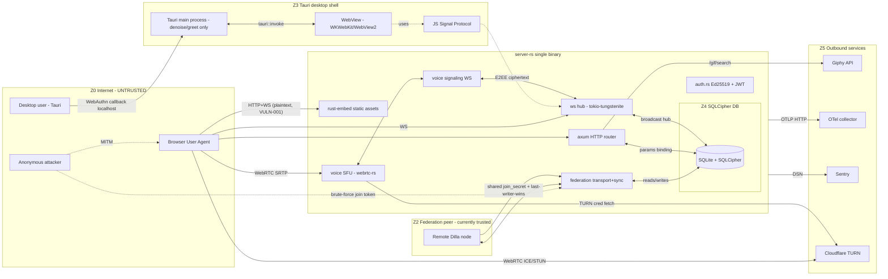

# Dilla — Comprehensive STRIDE Threat Model (Step 2)

**Scope:** `/Users/thim/Repositories/dilla-chat/` — server-rs, client/src, client/src-tauri
**Inputs:** `.security-hardening/01-vulnerability-scan.md`, code review of `server-rs/src/`, `client/src/services/crypto/`, `client/src-tauri/src/`.
**Methodology:** STRIDE per element + per data flow, attack trees for top-5 risks, CVSS-weighted DREAD-style risk matrix, MITRE ATT&CK mapping (Enterprise v15), business impact scoring against Dilla's "federated metadata-protecting E2EE chat" value proposition.

**Bottom-line:** Dilla's *cryptographic core* is sound — Signal Protocol (X3DH + Double Ratchet) is properly implemented in `client/src/services/crypto/`, message bodies remain confidential even given a fully compromised server. What is **not** sound is everything *around* that core: federation trust, transport security, authorization on WebSocket subscriptions, attachment access control, and operator-side configuration footguns. The realistic attacker is not "breaks Signal Protocol" — it is **"reads message metadata and impersonates peers"**, and against that attacker Dilla today is **not defensible**.

> **Correction to source material:** the project README/CLAUDE.md states "Signal Protocol crypto implemented in Rust, called from React via Tauri IPC". The actual implementation is **pure TypeScript** (`client/src/services/crypto/x3dh.ts`, `ratchet.ts`, `groupSession.ts`) using `WebCrypto`. The Tauri IPC surface (`client/src-tauri/src/main.rs`) exposes only `greet` and `denoise_frame`. This materially changes the trust model — crypto runs inside the browser engine (WebView2 / WKWebView / WebKitGTK), not inside the more-controlled native binary.

---

## 1. System Decomposition & Trust Boundaries

### 1.1 Trust zones

| Zone | Trust | Notes |
|---|---|---|
| Z0 Internet (anonymous) | UNTRUSTED | Anonymous network peers, on-path MITM |
| Z1 Authenticated client | UNTRUSTED-ish | Has a JWT but is treated as fully trusted today (key issue) |
| Z2 Federation peer | "semi-trusted" today (effectively trusted) | Should be UNTRUSTED |
| Z3 Tauri shell ⇄ Web frontend (IPC) | Cross-process boundary | Currently tiny (greet, denoise) |
| Z4 Server process ⇄ SQLCipher DB | Single-process boundary | Passphrase in process memory |
| Z5 Server ⇄ outbound HTTP | Server reaches Giphy / OTel / Sentry / Cloudflare TURN | Server-as-client to remote services |
| Z6 SFU media plane | Per-room peer-to-peer-ish via SFU | RTP encrypted by SFrame app-layer |

### 1.2 Data flow diagram (Mermaid)



### 1.3 Trust boundary crossings

- **TB-1** Z0 → REST handler (HTTPS/HTTP)
- **TB-2** Z0 → WebSocket upgrade
- **TB-3** Z1 → WS event router
- **TB-4** Z2 → Federation transport
- **TB-5** Z3 ⇄ WebView (Tauri IPC + WebAuthn HTTP loopback callback 65530-65534)
- **TB-6** Z4 SQLCipher passphrase derivation + open
- **TB-7** Z5 outbound (Giphy, OTel, Sentry, TURN)
- **TB-8** SFU control channel (signaling WS) → SFU media plane
- **TB-9** WebView → embedded assets — CSP boundary

---

## 2. STRIDE per element

### 2.1 Ed25519 challenge-response auth (TB-1, public)

| STRIDE | Threat | Maps to | Status |
|---|---|---|---|
| **S** | Replay a captured `(challenge, signature, public_key)` | VULN-001, VULN-022 | Challenge single-use + 5min — partial defense |
| **T** | Mutate JSON body in transit | VULN-001 | Server re-derives user_id from looked-up pubkey; OK |
| **R** | "I never logged in" — server logs only IP + user_id, signature not stored | NEW: AUTH-LOG-1 | Audit log incomplete |
| **I** | Username enumeration via `/auth/challenge` reveal-on-existence | NEW: AUTH-ENUM-1 | Confirmed — challenge issued only for known users |
| **D** | Flood `/auth/challenge` | gated by `tower_governor`; OK |
| **E** | Bootstrap-token replay grants admin | VULN-009 | High |

### 2.2 JWT mint / validate / refresh

| STRIDE | Threat | Maps | Status |
|---|---|---|---|
| **S** | Use stolen JWT (captured via VULN-001) | VULN-001, VULN-012 | 1h access / 7d refresh — no revocation |
| **S** | Replay JWT cross-tenant | VULN-012 | Confirmed: no `aud`/`iss` |
| **T** | Algorithm confusion | — | OK: `Algorithm::HS256` pinned |
| **T** | Token-type confusion (refresh used as access) | — | OK: `token_type` claim distinct |
| **R** | Stolen JWT used long after key holder rotated identity | VULN-012 | No `jti` revocation list |
| **D** | HS256 verify spam | VULN-011 | Confirmed |
| **E** | Forge JWT via brute-forced HMAC if `DILLA_JWT_SECRET` empty | NEW: AUTH-WEAK-1 | Partial — HKDFs but weak passphrase weakens JWT |

### 2.3 WebSocket hub subscribe/broadcast

| STRIDE | Threat | Maps | Status |
|---|---|---|---|
| **T** | Inject events bypassing the subscriber map by spoofing `channel_id` | **VULN-004, VULN-024** | **Confirmed — biggest practical metadata leak** |
| **I** | Eavesdrop on every channel by enumerating `channel_id` | **VULN-004, VULN-024, VULN-016, VULN-020** | **Critical metadata breach** |
| **D** | Open many WS clients, never pong | VULN-023 | Confirmed |
| **D** | Subscribe to thousands of channels in one client | NEW: WS-AMP-1 | No per-client subscription cap |
| **E** | Trigger admin-only WS events | OK — `PERM_MUTE_VOICE` checked | Verified clean |

### 2.4 REST message endpoints

| STRIDE | Threat | Maps | Status |
|---|---|---|---|
| **T/I** | Bypass private-channel restriction via REST | **VULN-007** | Confirmed; WS path checks, REST does not |
| **R** | Message edit/delete without audit trail | NEW: MSG-AUDIT-1 | No `audit_events` row for message:edit |
| **D** | Long-running `list?limit=999999999` | NEW: MSG-DOS-1 | Need server-side bound |

### 2.5 REST attachment endpoints

| STRIDE | Threat | Maps | Status |
|---|---|---|---|
| **R** | Anonymous download leaves no log linking to a user | **VULN-003** | Confirmed |
| **I** | Download any attachment ciphertext if you know/guess UUID | **VULN-003** | Critical-for-metadata |
| **I** | Cloud-CDN free hosting for arbitrary MIME-typed payloads | **VULN-008** | Confirmed |
| **D** | Upload to fill `upload_dir` | NEW: UPL-DOS-1 | Need disk quota |

### 2.6 Signal Protocol X3DH

| STRIDE | Threat | Maps | Status |
|---|---|---|---|
| **S** | Server swaps IK/SPK to mount a key-substitution MitM | NEW: X3DH-SUB-1 | TOFU — first session is server-trusting |
| **I** | Drain OTPKs to force "no OTPK" fallback | **VULN-006** | Critical privacy property; OTPK consumption unauthenticated |
| **E** | Compromised server returns its own IK_pub for a user → reads first messages until safety numbers diverge | NEW: X3DH-MITM-1 | Inherent in TOFU-style Signal deployments |

### 2.7 Double Ratchet decrypt

| STRIDE | Threat | Maps | Status |
|---|---|---|---|
| **T** | Skipped-key window memory growth | NEW: DR-DOS-1 | MAX_SKIP=256 — OK |
| **I** | Recover keys via WebView memory-dump (XSS or extension) | NEW: DR-XSS-1 | XSS would compromise long-lived ratchet keys in IndexedDB |
| **E** | Replace `crypto/index.ts` via supply-chain | NEW: DR-SUPPLY-1 | Critical protobufjs advisory; no SRI |

### 2.8 Group sender-key distribution

| STRIDE | Threat | Maps | Status |
|---|---|---|---|
| **I** | Subscribe to victim channel, capture sender-key envelope addressed-to-you | **VULN-004** | Confirmed pivot |
| **T** | Replay old sender-key distribution to roll member back | NEW: SK-REPLAY-1 | No per-channel epoch check |
| **E** | Get added as member via federation merge, then receive future SKs | **VULN-002** | Critical |

### 2.9 Federation state-sync merge

| STRIDE | Threat | Maps | Status |
|---|---|---|---|
| **S** | Spoof peer (or empty default secret) | **VULN-002, VULN-005, VULN-021** | **Critical** |
| **T** | Forge channels/roles/members/messages | **VULN-002** | **Critical** |
| **R** | No log "this row came from peer X with signature Y" | NEW: FED-AUDIT-1 | Confirmed — last-writer-wins, no provenance |
| **I** | Peer reads all replicated messages (ciphertext + sender + timing) | NEW: FED-META-1 | Federation pushes ciphertext + metadata — peer learns full social graph |
| **D** | Peer floods 10k messages × 100 channels every 5 minutes | **VULN-002** | Confirmed |
| **E** | Promote attacker to `PERM_ADMIN` via forged role assignment | **VULN-002** | Confirmed |

### 2.10 Federation event replication

| STRIDE | Threat | Maps | Status |
|---|---|---|---|
| **S** | Forge `author_id` on replicated `message:new` | **VULN-002** | Confirmed |
| **T** | Edit/delete any message by ID on receiving node | **VULN-002** | Confirmed |
| **R** | No signed-by-origin-node receipt | NEW: FED-NOREP-1 | Confirmed |
| **I** | Replication of typing/presence/reactions metadata to hostile peer | NEW: FED-META-2 | Confirmed |

### 2.11 Federation join-token mint / validate

| STRIDE | Threat | Maps | Status |
|---|---|---|---|
| **S** | Mint join JWT offline once shared secret recovered | **VULN-005** | Confirmed |
| **R** | Token has no `jti`; can't be revoked | NEW: FED-JTI-1 | Confirmed |

### 2.12 SFU signaling

| STRIDE | Threat | Maps | Status |
|---|---|---|---|
| **I** | Subscribe to a voice channel ICE-candidate stream → harvest member IPs | NEW: SFU-IP-1 + VULN-004 chain | Confirmed |
| **D** | Spam `voice:join`/`voice:leave` to thrash SFU PeerConnection allocation | NEW: SFU-DOS-1 | No rate limit |

### 2.13 SFrame voice key distribution

| STRIDE | Threat | Maps | Status |
|---|---|---|---|
| **I** | If VULN-004 lets attacker join voice channel's WS room, harvest SFrame-key envelope size + timing | NEW: SF-META-1 | Confirmed metadata-only |

### 2.14 Bootstrap token first-run path

| STRIDE | Threat | Maps | Status |
|---|---|---|---|
| **R/I/E** | Token in stderr → journald → forever; anyone with log access becomes admin | **VULN-009** | Critical for ops |

### 2.15 SQLCipher DB at rest

| STRIDE | Threat | Maps | Status |
|---|---|---|---|
| **I** | Empty `DB_PASSPHRASE` → plaintext DB | startup warns; explicit user choice |
| **I** | Key not zeroized in process memory | NEW: DB-MEM-1 | Verify with full audit |

### 2.16 Tauri IPC surface

| STRIDE | Threat | Maps | Status |
|---|---|---|---|
| **S** | Loopback HTTP callback at 65530-65534 races local malware | NEW: TAU-LOOP-1 | Low |
| **T** | Missing `client/src-tauri/Cargo.lock` | NEW: TAU-SUPPLY-1 | Confirmed — `.gitignore:7` excludes it |

### 2.17 Browser-log relay

| STRIDE | Threat | Maps | Status |
|---|---|---|---|
| **R/D/I** | Forge log entries; unauthenticated flood; ANSI escapes | **VULN-010** | Confirmed |

### 2.18 rust-embed static webapp delivery

| STRIDE | Threat | Maps | Status |
|---|---|---|---|
| **T** | Tampered server binary serves modified JS bundle | NEW: EMB-INTEG-1 | No SRI on JS chunks |
| **I** | `GET /api/v1/config` leaks `tls_enabled`, `db_encrypted` to anonymous callers | Source table | Confirmed |

### 2.19 Outbound HTTP

| STRIDE | Threat | Maps | Status |
|---|---|---|---|
| **I** | Giphy URL fetched server-side leaks server IP + search term | NEW: OUT-GIPHY-1 | Confirmed by design |
| **I** | OTel/Sentry receive PII | NEW: OUT-PII-1 | Verify scrubbing config |
| **T** | SSRF via attacker-controlled URL fields | NEW: OUT-SSRF-1 | Need full audit |
| **D** | Inbound trigger forces outbound Giphy fetch → quota burn | NEW: OUT-DOS-1 | Confirmed |

---

## 3. Attack Trees — Top 5 risks

### 3.1 G1: Read every message in a private channel without being a member (VULN-004 / VULN-024)

```
G1: Read all messages + metadata of a private channel
├─ OR  Subscribe via WS channel:join (VULN-004 / VULN-024)
│       AND ─ Obtain valid JWT
│       │      ├─ OR Register normally
│       │      ├─ OR Steal JWT via plaintext capture (VULN-001)
│       │      └─ OR Replay refresh token (7d) (VULN-012)
│       AND ─ Enumerate / guess channel_id
│       │      ├─ OR Read team's channel list via REST
│       │      └─ OR Pivot from leaked logs (VULN-009/010)
│       └─ AND  Decode ciphertext  ← REQUIRES sender-key (you don't have it)
│              └─ but METADATA already won
├─ OR  Federation injection (VULN-002 + VULN-005)
│       AND ─ Obtain join_secret OR connect to peer with empty secret
│       AND ─ Forge `member` row putting attacker into the team
│       AND ─ Wait for sender-key envelope addressed to attacker
│       └─ AND Decrypt with attacker's IK_priv  → FULL message content
```

### 3.2 G2: Take over admin of a federated team (VULN-002)

```
G2: Become ADMIN of team T on victim node V
├─ AND  Have a federation peer with TLS off / join_secret known
│       ├─ OR Default empty (transport.rs:172) → no auth at all
│       ├─ OR Capture join JWT over plain ws:// (VULN-014) and brute-force HMAC (VULN-005)
│       └─ OR Operator left "changeme"
├─ AND  Send forged state_sync containing:
│       ├─ merge_roles: new role R with PERM_ADMIN, team_id=T
│       └─ merge_members: row (user_id=attacker, team_id=T, role=R)
└─ AND  Reconnect as that user to victim node
        └─ Server merges last-writer-wins → admin granted
```

### 3.3 G3: Exfiltrate every attachment on the server (VULN-003 + VULN-008)

```
G3: Bulk attachment exfiltration
├─ AND  Discover attachment_ids
│       ├─ OR  Subscribe to all channels via VULN-004 → harvest IDs
│       ├─ OR  Federation peer dump (VULN-002)
│       └─ OR  Find IDs in browser-log relay forwarded text (VULN-010)
└─ AND  GET /api/v1/teams/{tid}/attachments/{aid}  ← public (VULN-003)
        └─ Bytes are ciphertext but headers leak filename/content-type (VULN-008)
```

### 3.4 G4: MITM every newly-joined client (VULN-001)

```
G4: Network-level full takeover of a user
├─ AND  On-path position (LAN ARP, ISP, hostile café, BGP)
├─ AND  Server runs with TLS_CERT/TLS_KEY set but no actual TLS (VULN-001)
├─ AND  Intercept first login flow
│       ├─ Capture bootstrap token from server banner if proxied alongside logs
│       ├─ Or capture refresh token from `/auth/verify` response
│       └─ Or simply MITM all WS frames → metadata + ciphertext
└─ AND  Pivot
        ├─ Use stolen JWT to run G1 (subscribe everything)
        ├─ Use stolen refresh to maintain access for 7 days (VULN-012)
        └─ Combine with VULN-006 to drain victim's OTPKs offline
```

### 3.5 G5: Identity/prekey-bundle enumeration (VULN-006)

```
G5: Build a global user dossier
├─ AND  Have any valid JWT (register a user → trivial)
├─ AND  Enumerate user_ids
│       ├─ OR  /api/v1/users/{id}
│       ├─ OR  Federation peer dump (VULN-002)
│       └─ OR  Scrape from message:new events (after G1)
└─ AND  Loop: GET /api/v1/prekeys/{user_id}
        ├─ Recover identity_key, identity_dh_key per user (deanonymization)
        └─ Consume OTPK per call → force FS-degraded fallback
```

---

## 4. Risk Matrix (likelihood × impact, all findings)

| ID | Title | L | I | Risk |
|---|---|---|---|---|
| VULN-001 | No TLS even when configured | H | Critical | **CRITICAL** |
| VULN-002 | Federation trust + last-writer-wins | M | Critical | **CRITICAL** |
| VULN-003 | Public attachment endpoint | M | High | **HIGH** |
| VULN-004 | WS channel:join no access check | **H** | **High** | **CRITICAL in practice** |
| VULN-005 | join_secret used as raw HMAC key | M | High | **HIGH** |
| VULN-006 | Anyone fetches any prekey bundle + drains OTPKs | H | M | **HIGH** |
| VULN-007 | REST message endpoints skip per-channel ACL | H | M | **HIGH** |
| VULN-008 | User-controlled attachment Content-Type | M | M | **MED** |
| VULN-009 | Bootstrap token in stderr | M | Critical | **HIGH** |
| VULN-010 | Browser-log relay public | H | L | **MED** |
| VULN-011 | No rate limit on protected endpoints | H | M | **MED** |
| VULN-012 | JWT no aud/iss/revocation | M | H | **HIGH** |
| VULN-013 | Unbounded identity_blob | H | L | **MED** |
| VULN-014 | ws:// peers accepted with only warning | M | H | **HIGH** |
| VULN-015 | AES-GCM random nonce (theoretical) | L | L | **LOW** |
| VULN-016 | Typing indicators broadcast unconditionally | H | L | **MED** |
| VULN-017 | protobufjs Critical advisory | M | M | **MED** |
| VULN-018 | postcss < 8.5.10 | L | L | **LOW** |
| VULN-019 | @protobufjs/utf8 overlong UTF-8 | L | L | **LOW** |
| VULN-020 | WS `team` param accepted without member check | M | L | **MED** |
| VULN-021 | join_secret random fallback lost on restart | M | M | **MED** |
| VULN-022 | DB `=` token compare non-constant-time | L | L | **INFO** |
| VULN-023 | PONG_WAIT only checked when message arrives | H | L | **MED** |
| VULN-024 | channel:join doesn't discriminate channel type (DMs) | H | High | **HIGH** |
| **NEW** AUTH-ENUM-1 | Username enumeration via challenge endpoint | H | M | **HIGH** |
| **NEW** AUTH-LOG-1 | Auth events lack stored signature for non-repudiation | L | L | **LOW** |
| **NEW** AUTH-WEAK-1 | JWT HMAC derived from DB passphrase → weak passphrases weaken JWT | M | H | **HIGH** |
| **NEW** WS-AMP-1 | No per-client subscription cap | M | M | **MED** |
| **NEW** MSG-AUDIT-1 | Message edit/delete not audit-logged | M | M | **MED** |
| **NEW** MSG-DOS-1 | Unbounded `limit=` on list | M | L | **LOW** |
| **NEW** UPL-DOS-1 | No upload quota | H | M | **MED** |
| **NEW** X3DH-SUB-1 | TOFU IK pinning → server can MITM first session | M | H | **HIGH** |
| **NEW** X3DH-MITM-1 | Compromised server returns own IK_pub | M | H | **HIGH** |
| **NEW** DR-XSS-1 | Ratchet keys vulnerable to WebView XSS | L | Critical | **HIGH** |
| **NEW** DR-SUPPLY-1 | No SRI on JS chunks; transitive Critical advisory | M | Critical | **CRITICAL** |
| **NEW** SK-REPLAY-1 | Sender-key replay possible | L | M | **MED** |
| **NEW** FED-META-1 | Federation peer learns ciphertext + full metadata | H (by design today) | H | **HIGH** |
| **NEW** SFU-IP-1 | ICE candidates leak speaker IPs (chained with VULN-004) | M | H | **HIGH** |
| **NEW** SFU-DOS-1 | No rate limit on voice:join/leave | M | M | **MED** |
| **NEW** DB-MEM-1 | Passphrase not zeroized in memory | L | M | **LOW** |
| **NEW** TAU-LOOP-1 | Loopback 65530 callback races local malware | L | M | **LOW** |
| **NEW** TAU-SUPPLY-1 | Missing `client/src-tauri/Cargo.lock` | M | M | **MED** |
| **NEW** EMB-INTEG-1 | No SRI/binary signature on shipped JS bundle | M | H | **HIGH** |
| **NEW** OUT-GIPHY-1 | Server-side Giphy leaks per-query metadata | H | M | **MED** |
| **NEW** OUT-SSRF-1 | Possible SSRF via user-controlled embed URLs | ? | H | **MED–HIGH** |
| **NEW** PR-SOCIAL-1 | Public bootstrap-token banner pasted into chat support → social pivot | M | H | **HIGH** |

---

## 5. MITRE ATT&CK mapping

| Scenario | ATT&CK Techniques | Mapped findings |
|---|---|---|
| Plaintext network capture | T1040 · T1557.002 · T1185 | VULN-001, VULN-014 |
| Federation peer-as-trusted | T1199 · T1078.004 · T1565.001 · T1098.003 | VULN-002, VULN-005, VULN-021 |
| Attachment exfiltration via unauth endpoint | T1190 · T1530 · T1567 | VULN-003, VULN-008 |
| WS channel:join authorization bypass | T1190 · T1213 | VULN-004, VULN-024, VULN-016 |
| Bootstrap token exposure in logs | T1602.002 · T1078.004 · T1552.001 | VULN-009 |
| OTPK drain + identity enumeration | T1110.001 · T1499.002 · T1589.002 | VULN-006, VULN-011 |
| Cross-tenant JWT replay | T1078 · T1556 · T1212 | VULN-012 |
| Log injection via browser-log relay | T1071.001 · T1562.002 | VULN-010 |
| Idle WS ghost connections | T1499 · T1499.004 | VULN-023, WS-AMP-1 |
| Federation join token brute force | T1110.002 · T1212 | VULN-005 |
| ICE-candidate IP leak (chained) | T1590.005 · T1213 | NEW SFU-IP-1 + VULN-004 |
| Supply-chain JS bundle poisoning | T1195.002 · T1554 | VULN-017, DR-SUPPLY-1, EMB-INTEG-1 |
| Bootstrap-token social pivot | T1566.001 · T1199 | PR-SOCIAL-1 |
| Username enumeration | T1087.004 · T1589.002 | AUTH-ENUM-1 |
| X3DH server-side IK substitution | T1557 · T1556 | X3DH-MITM-1, X3DH-SUB-1 |

---

## 6. Business impact analysis

| Risk | Confidentiality | Integrity | Availability | Operator trust | Reputation | GDPR |
|---|---|---|---|---|---|---|
| VULN-001 No TLS | 5 | 4 | 2 | 5 | 5 | 5 |
| VULN-002 Federation | 4 | 5 | 4 | 5 | 5 | 4 |
| VULN-004 WS channel:join | 5 | 1 | 1 | 3 | 5 | 4 |
| VULN-003 Public attachments | 4 | 1 | 1 | 3 | 4 | 4 |
| VULN-005 join_secret HMAC | 3 | 5 | 3 | 4 | 4 | 3 |
| VULN-006 prekey enum + drain | 4 | 1 | 2 | 2 | 4 | 4 |
| VULN-009 Bootstrap token | 4 | 5 | 2 | 5 | 4 | 3 |
| VULN-012 JWT no aud/iss | 3 | 4 | 1 | 3 | 3 | 2 |
| VULN-014 ws:// federation | 4 | 4 | 2 | 5 | 4 | 3 |
| NEW DR-SUPPLY-1 (JS supply chain) | 5 | 5 | 2 | 3 | 5 | 5 |

The two findings with **5** in *both* "Reputation" *and* "Confidentiality" are **VULN-004** and **DR-SUPPLY-1** — these are the threats whose materialization most directly invalidates Dilla's marketing claim. **VULN-002** is the threat most directly damaging to *operator* trust.

---

## 7. Prioritized Top-10 Threat List

| # | Title | STRIDE | Maps | L | I | Business impact | Horizon |
|---|---|---|---|---|---|---|---|
| 1 | Plaintext WS leaks tokens, ciphertext, every metadata field | I, T, S | VULN-001, VULN-014 | H | Critical | Falsifies marketing claim; legal exposure | **Immediate (P0)** |
| 2 | Federation peer can forge channels/roles/members/messages | T, S, E | VULN-002, VULN-005, VULN-021 | M | Critical | Federation is the differentiator; turns peer into superuser | **Immediate (P0)** |
| 3 | Any logged-in user can subscribe to any channel via WS | I, T | VULN-004, VULN-024, VULN-016, VULN-020 | H | High | Biggest practical breach of "metadata-protecting" promise | **Immediate (P0)** |
| 4 | Anyone can download any attachment + see filename/content-type | I, T, R | VULN-003, VULN-008 | M | High | Anon ciphertext bulk-exfil; free malware CDN | **Immediate (P0)** |
| 5 | JS supply-chain compromise exfiltrates ratchet keys | T, E, I | VULN-017, DR-SUPPLY-1, EMB-INTEG-1 | M | Critical | Poisoned chunk reads message keys; catastrophic | **Pre-public-launch (P1)** |
| 6 | Bootstrap admin token written to stderr | I, E, R | VULN-009 | M | Critical | Any operator with log access → admin | **Immediate (P0)** |
| 7 | Identity-key enumeration + OTPK drain | I, D | VULN-006 | H | M | Deanonymizes every registered user | **Pre-public-launch (P1)** |
| 8 | REST message endpoints skip per-channel ACL | I, T | VULN-007 | H | M | Excluded members can still POST/GET | **Immediate (P0)** |
| 9 | JWT lacks aud/iss/revocation; refresh window 7 days | S, T | VULN-012, AUTH-WEAK-1 | M | H | Cross-node token replay; week-long stolen-token validity | **Pre-public-launch (P1)** |
| 10 | No rate limit on protected endpoints; idle WS ghost connections | D | VULN-011, VULN-023 | H | M | Trivial DoS, OTPK drain amplifier, upload flood | **Pre-public-launch (P1)** |

---

## 8. Threats not driven by a numbered finding

1. **AUTH-ENUM-1** — Username enumeration via challenge endpoint.
2. **AUTH-WEAK-1** — JWT HMAC seeded from DB passphrase → weak passphrases weaken JWT.
3. **X3DH-SUB-1 / X3DH-MITM-1** — TOFU on Signal identity keys; safety-numbers UI exists but is opt-in.
4. **FED-META-1** — Federation peer learns ciphertext + full metadata graph by design.
5. **EMB-INTEG-1** — JS bundle has no SRI and no signature.
6. **TAU-SUPPLY-1** — Missing `client/src-tauri/Cargo.lock`.
7. **SFU-IP-1** — Voice ICE candidates leak IPs of every voice participant (chained with VULN-004).
8. **PR-SOCIAL-1** — Bootstrap-token banner as social-engineering pivot.
9. **OUT-GIPHY-1 / OUT-PII-1** — Outbound Giphy / OTel / Sentry leak metadata.

---

## 9. Executive Risk Summary

**Project:** Dilla — federated, self-hosted, E2EE Discord alternative (AGPLv3).
**Date:** 2026-05-21.

**The good news.** The cryptographic core is correct. Signal Protocol (X3DH + Double Ratchet + group sender keys), Ed25519 verification on prekey bundles, AES-GCM with WebCrypto-derived random nonces and per-message key rotation, constant-time byte compare. **A fully compromised server cannot read message bodies.** SQL injection, command injection, path traversal, alg-confusion, insecure deserialization — all checked, all clean.

**The bad news.** Everything *around* the crypto core is misconfigured or unauthorized.

**Three threats invalidate the project's core marketing claims and must be fixed before any public launch:**

1. **The server runs HTTP even when an operator configures TLS** (VULN-001).
2. **Federation peers are fully trusted** (VULN-002, VULN-005).
3. **Any authenticated user can subscribe to any channel** including DMs (VULN-004, VULN-024).

**Three more must be fixed pre-public-launch:**

4. **Public attachment endpoint** (VULN-003, VULN-008).
5. **Bootstrap admin token logged to stderr** (VULN-009).
6. **Prekey-bundle enumeration + OTPK drain** (VULN-006).

**Two structural risks merit special attention:**

- **JS supply-chain compromise** (npm `protobufjs` Critical advisory + no SRI on shipped JS) is the only path to recovering ratchet keys today.
- **Federated metadata sharing is inherent to the design.** Even after every fix above ships, a *legitimate* federation peer learns ciphertext and the full social graph for every replicated team. Document this honestly in `SECURITY.md`.

**Top-3 fixes by ROI:**
1. Enforce TLS at bind time → resolves VULN-001 + half the impact of VULN-014.
2. Add `user_can_access_channel` in `handle_channel_event` → resolves VULN-004, VULN-024, VULN-016, VULN-020.
3. Sign every federation event with per-node Ed25519, reject empty `join_secret` → resolves VULN-002, VULN-005, VULN-021.

After those three ship, Dilla's posture moves from **"vulnerable to a moderately-resourced attacker on day one"** to **"defensible-as-pitched, with documented federation trust model"**.
