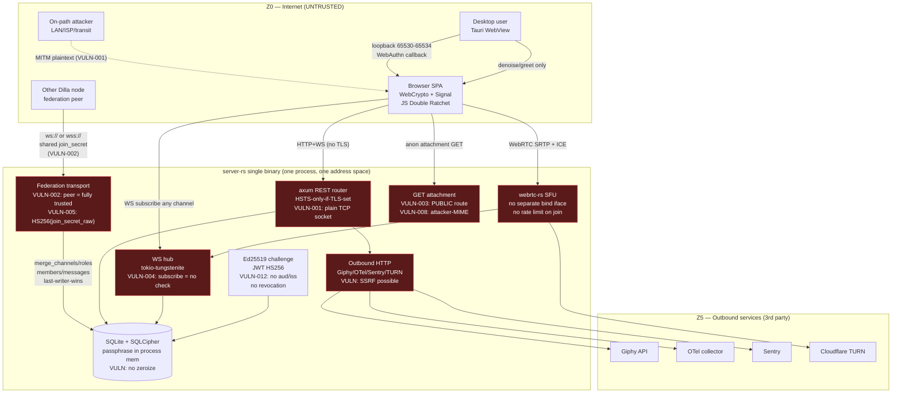
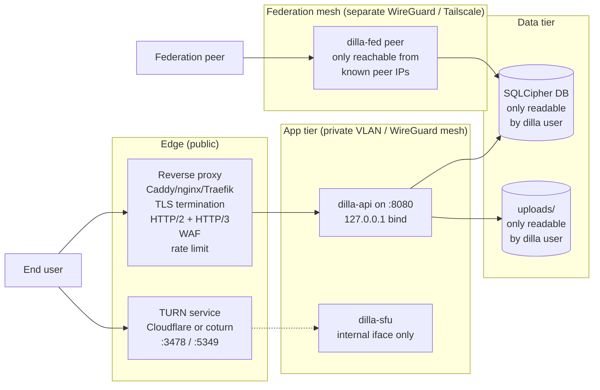

# Dilla — Architecture Security Review (Step 3)

**Scope:** `/Users/thim/Repositories/dilla-chat/` — `server-rs/`, `client/src/`, `client/src-tauri/`
**Inputs:** `.security-hardening/01-vulnerability-scan.md` (24 findings), `.security-hardening/02-threat-model.md` (STRIDE + attack trees + MITRE ATT&CK), targeted re-reads of `server-rs/src/main.rs`, `auth.rs`, `config.rs`, `api/mod.rs`, `api/uploads.rs`, `api/prekeys.rs`, `api/gif.rs`, `db/mod.rs`, `federation/{transport,sync,join,mod}.rs`, `ws/{hub,client}.rs`, `voice/signaling.rs`, `client/src-tauri/{src/main.rs,tauri.conf.json}`.
**Method:** boundary mapping, data-flow tracing, trust-zone enumeration, mTLS/SPIFFE applicability check, zero-trust gap analysis. Every recommendation is keyed to one or more `DILLA-VULN-NNN` IDs or to a new threat-model finding so Step 4 (critical fixes) has a traceable rationale.

---

## 1. Executive summary

Dilla's cryptographic core (`client/src/services/crypto/`) is correct — X3DH, Double Ratchet, group sender keys, AES-GCM with WebCrypto-derived nonces, constant-time compare, Ed25519 verification. **Message-body confidentiality survives a fully compromised server.** Architecturally, however, Dilla is a single Rust binary that bundles four wildly different threat profiles into one address space — public HTTP/WS surface, federation transport, an SFU built on `webrtc-rs`, and outbound HTTP egress to Giphy/OTel/Sentry/Cloudflare. Every one of those subsystems is reachable by an attacker with no isolation between them, and the federation transport in particular runs with last-writer-wins merges against an unsigned wire format that today treats every peer as fully trusted (DILLA-VULN-002). The next architectural step is **not to split the monolith for its own sake** but to introduce trust boundaries that map to the existing threat profile — TLS terminated *in front of* Dilla, federation events *signed* by per-node Ed25519 keys, WebSocket subscriptions *gated* by `user_can_access_channel`, the SFU bound to a *separate interface* with TURN as the only public path, and per-process credentials/process budgets that make a webrtc-rs CVE or a federation peer compromise survivable. Phase 2 should be **TLS + WS auth + federation signing + attachment auth**; Phase 3 should be **process split for SFU + federation, plus moving the WebView crypto into a Web Worker with no IndexedDB exposure**.

---

## 2. Current architecture (today, with controls and gaps)



**Trust gaps highlighted in red.** Note all subsystems share a single Rust address space — a CVE in `webrtc-rs` (red SFU box) or a hostile federation peer (red FED box) is one memory-safety bug or one unsigned `merge_roles(PERM_ADMIN)` away from owning the JWT signing secret, the SQLCipher passphrase, and every other in-flight client's session.

---

## 3. Target architecture (post-Phase 2/3)

```mermaid
flowchart TB
  subgraph PROXY["Public edge (operator-supplied reverse proxy)"]
    EDGE[Caddy / nginx / Traefik<br/>TLS 1.3, ACME, HSTS<br/>HTTP/2 + HTTP/3<br/>WAF rules, rate limiting]
  end

  subgraph DILLA_API["dilla-api (own systemd unit / container)"]
    direction TB
    REST2["axum REST<br/>auth + RBAC<br/>per-route rate limit<br/>OPA-style channel ACL"]
    WS2["WS hub<br/>subscribe gated by<br/>user_can_access_channel"]
    AUTH2["Ed25519 + JWT (aud/iss/jti)<br/>OR: stateful sessions"]
    DB2[("SQLCipher<br/>key from OS keychain<br/>zeroize on drop")]
    UPLOADS2["Attachment proxy<br/>JWT + channel ACL<br/>sanitized MIME<br/>CSP sandbox header"]
  end

  subgraph DILLA_FED["dilla-fed (own process)"]
    direction TB
    FED_TRANSPORT["Federation transport<br/>mTLS pinned per peer<br/>OR: signed events"]
    FED_SIGN["Per-node Ed25519 signing key<br/>signed event log<br/>provenance audit row"]
    FED_QUEUE["Inbound merge queue<br/>integrity-checked before<br/>cross-process write to DB"]
  end

  subgraph DILLA_SFU["dilla-sfu (own process)"]
    direction TB
    SFU2["webrtc-rs SFU<br/>bound to internal iface<br/>RTP only through TURN<br/>per-room budget"]
  end

  subgraph DILLA_EGRESS["dilla-egress (own process or sidecar)"]
    direction TB
    EGRESS2["Outbound HTTP proxy<br/>allow-list of hosts<br/>SSRF guard<br/>no DB credentials"]
  end

  subgraph CLIENT["Client surface"]
    BROWSER2[Browser SPA<br/>SRI on JS chunks<br/>strict CSP<br/>Crypto Web Worker<br/>(no IndexedDB on main thread)]
    TAURI2[Tauri WebView<br/>hardened CSP<br/>navigation locked to app<br/>WKWebView/WebView2 disable<br/>devtools in prod]
  end

  subgraph PEERS["Z2 — Federation mesh (per-peer trust)"]
    PEER2[Remote Dilla node]
  end

  subgraph IPC["Inter-process control plane (UDS / Unix socket / token+mTLS)"]
    DB_BROKER[DB write broker<br/>capability-gated]
  end

  BROWSER2 -->|"TLS 1.3, HSTS, SCT"| EDGE
  TAURI2 -->|"TLS 1.3, cert pin"| EDGE
  EDGE --> REST2
  EDGE --> WS2
  EDGE --> UPLOADS2

  REST2 --> DB2
  WS2 --> DB2
  AUTH2 --> DB2
  UPLOADS2 --> DB2

  PEER2 <-->|"mTLS pinned<br/>signed FederationEvent"| FED_TRANSPORT
  FED_TRANSPORT --> FED_SIGN
  FED_SIGN --> FED_QUEUE
  FED_QUEUE -->|"validated merges only"| DB_BROKER
  DB_BROKER --> DB2

  BROWSER2 -->|"WebRTC SRTP via TURN only"| SFU2
  SFU2 -.->|"signaling via WS (Unix domain)"| WS2

  REST2 -->|"egress calls via local UDS"| EGRESS2
  EGRESS2 --> GIPHY[Giphy]
  EGRESS2 --> OTEL[OTel]
  EGRESS2 --> SENTRY[Sentry]
  SFU2 --> TURNSVC[Cloudflare TURN]

  classDef good fill:#1a3a1a,stroke:#5eebab,color:#fff
  class EDGE,REST2,WS2,UPLOADS2,FED_TRANSPORT,FED_SIGN,SFU2,EGRESS2,DB_BROKER,BROWSER2,TAURI2 good
```

Phase 2 implements the gating controls in-process; Phase 3 splits SFU + federation into separate processes. Both phases use the same external surface, so the operator-facing deployment manifest doesn't change between them — the only difference is the systemd unit count and whether the DB write path is gated by a capability broker.

---

## 4. Service boundary recommendations

### 4.1 Should SFU live in a separate process?

**Yes, in Phase 3.** Rationale:

- **Blast radius.** `webrtc-rs` is a young, fast-moving crate (`webrtc 0.17.1` at the time of the SBOM). A memory-safety CVE in `webrtc-rs`, `webrtc-srtp`, or one of the deeper dependencies (`rcgen`, `dtls`, `interceptor`) would today expose the JWT secret, SQLCipher passphrase, and every in-memory ratchet/sender-key envelope in transit through `WS hub`. A process split puts at most the RTP forwarding state at risk. The Rust SFU is the *only* component where third-party untrusted RTP bytes are parsed (Opus/VP8 payloads, RTP headers, RTCP feedback) — an SRTP-decrypt or packetizer parser bug is the realistic exploitation path. (Addresses **NEW-SFU-DOS-1**, the latent exposure class behind any future `webrtc-rs` CVE, and the chained leak path in **SFU-IP-1 + VULN-004**.)
- **Bind interface.** Today the SFU shares port `DILLA_PORT` and listens on `0.0.0.0`. A separate process can bind RTP to a constrained interface (e.g. `100.64.0.0/10` for Tailscale, or only the TURN-relay outbound IP) and refuse all other traffic.
- **Restart isolation.** SFU restart today drops every voice room. With a process split, the API/WS hub stays up; the SFU bridge layer (`server-rs/src/voice/sfu_bridge.rs`) already mediates events, so it can be converted to a UDS/gRPC client that survives SFU restart.

**Implementation sketch:**
- New crate `dilla-sfu` in the workspace, owning `voice/{signaling,room,sfu_bridge,sfu_helpers,turn}.rs`.
- IPC over Unix domain socket carrying `SFUEvent` (already defined as `enum SFUEvent` in `voice/signaling.rs`). Use length-prefixed CBOR or `bincode` — schema is internal so no JSON cost.
- Signaling messages keep coming through the public WS; the API binary forwards the JSON payloads to `dilla-sfu` over UDS. The SFU never holds JWTs — the API binary validates and stamps a short-lived "voice room ticket" before forwarding.

### 4.2 Should federation transport be its own process?

**Yes, in Phase 3, and this one matters more than the SFU split.** Rationale:

- **Threat model.** Federation peers are explicitly untrusted (DILLA-VULN-002), but today they live in the same process as the JWT issuer. A peer that forces a panic via a malformed `FederationEvent`, or chains a serde + last-writer-wins bug into out-of-bounds write, owns the API process.
- **Authoring authority.** With federation isolated, the only thing it can do is *propose* merges. A capability-gated DB broker (one Unix socket, mTLS-pinned identity, narrowly typed write proposals — `CreateChannel { team_id: TeamId, signed_by: NodeId }`) accepts or rejects them. The broker does **not** know how to write `roles.permissions = PERM_ADMIN` directly — it only knows how to write a row whose role was *signed by the team's claimed owner*. (Addresses DILLA-VULN-002, FED-AUDIT-1, FED-NOREP-1.)
- **Reconnection logic.** Today `start_reconnect_loop` lives in the same task pool as the request router. A peer that holds 50 stalled connections can starve API tokio workers. Federation process gets its own runtime budget.

**Implementation sketch:**
- New crate `dilla-fed` owning `federation/{transport,sync,join,mod}.rs`.
- API binary still owns `join_token` mint (it's a privileged write); federation process owns `join_token` *validation against signed transport*.
- DB write broker exposes a `FederationProposal` variant per legal write: `ReplicateMessage { signed_by_node: NodeId, signature: Ed25519Sig, payload: ReplicationMessage }`. Broker verifies node signature, looks up the node's pinned key, and rejects if the signature doesn't match.

### 4.3 Should outbound HTTP egress be a separate process?

**Yes, in Phase 3, as a Phase-3 polish.** Rationale:

- **SSRF posture.** Today the Giphy fetch (`api/gif.rs:93`) and the Cloudflare TURN credential exchange (`voice/turn.rs:39`) run in the same process that holds JWT signing keys, the SQLCipher passphrase, and every WebSocket connection's authenticated identity. A future feature that lets users paste an embed URL (Open Graph preview, image embed, etc.) becomes an SSRF time bomb. (Addresses **NEW-OUT-SSRF-1**.)
- **Outbound budget.** Egress quota burns (Giphy free tier, OTel quota) shouldn't be triggered from inside the request handler — a sidecar with a token bucket is the correct shape.
- **Why not Phase 2.** The current outbound footprint is small and has well-defined hostnames. Phase 2 should just enforce an allow-list of egress hostnames in-process; Phase 3 moves it out.

**Implementation sketch (Phase 2 minimum):**
- Add an `EgressClient` wrapper that refuses any URL whose host isn't in a startup-fixed allow-list (`api.giphy.com`, `<otel_endpoint>`, `<sentry_dsn>` host, `<turn>.cloudflareclient.com`).
- Use `reqwest::Client::builder().resolve_to_addrs(...)` to pin DNS resolution and refuse RFC-1918 / link-local / loopback A records (rebinding defense).

---

## 5. Data flow security tracing

### 5.1 Message body — client → WS hub → DB → federation replication

| Hop | Boundary | What crosses | Today's control | Gap |
|---|---|---|---|---|
| 1 | Z0 → REST/WS upgrade | JWT in `?token=` or single-use ticket in `?ticket=` | `validate_jwt`/`validate_ws_ticket` | **VULN-001** (no TLS so JWT is captureable); **VULN-020** (team param unchecked) |
| 2 | WS hub event router | `{type:"channel:join", channel_id}` | None — `handle_channel_event` just calls `hub.subscribe` | **VULN-004**: no `user_can_access_channel` check |
| 3 | Client sends `message:send` E2EE ciphertext + plaintext metadata (`channel_id`, `reply_to_id`, `attachment_ids`) | Team membership + channel access | OK (`handle_message_send`) | Metadata still leaks to any subscriber via Hop 2 |
| 4 | Hub → `db::create_message` | Plaintext ciphertext blob + plaintext metadata | Parametrized SQL; team check upstream | OK |
| 5 | Hub → federation event (`message:new`) | Same row + `author_id` | **None** (`mod.rs:418-480`) | **VULN-002**: peer can replay and forge `author_id` |
| 6 | Federation `merge_messages` on remote node | Last-writer-wins | Validates length cap only | **VULN-002**: no provenance check, no signature, no team membership check |
| 7 | Remote `hub.broadcast_to_channel` | Hub fans out to any subscriber | Inherits Hop 2 gap | **VULN-004 × federation hops** |

**Net.** A message body that the user encrypted client-side still flows through six trust crossings whose authorization model varies between "membership check via spawn_db" (good), "no check at all" (broken: hops 2, 5, 6), and "implicit trust via earlier check" (fragile). Phase 2 closes hops 2 and 5; Phase 3 closes hop 6.

### 5.2 Attachment — upload → DB row → public download endpoint

| Hop | Boundary | What crosses | Today's control | Gap |
|---|---|---|---|---|
| 1 | Z0 → POST `/teams/{tid}/channels/{cid}/messages/{mid}/attachments` | multipart blob + headers | JWT + team check + path traversal guard (uploads.rs:77-79) | **VULN-008**: stored `Content-Type` is raw client header |
| 2 | API writes `attachments` row | Ciphertext bytes + `content_type_encrypted` (actually plaintext) + `filename_encrypted` (also plaintext) | Storage path scoped to `{upload_dir}/{team_id}/{uuid}` | Schema field name is misleading — these are *not* encrypted |
| 3 | Federation replicates `message:new` | Attachment IDs included in message JSON | None | **VULN-002** chain |
| 4 | Z0 → GET `/teams/{tid}/attachments/{aid}` | None — anonymous | Team check **only if** `att.message_id` is non-empty (uploads.rs:139); upload-before-send window and Giphy embed path have *no* team check | **VULN-003**: anonymous bulk exfil possible |
| 5 | Response headers | `Content-Type` from attacker-controlled bytes | Global `X-Content-Type-Options: nosniff`; `Content-Disposition: attachment` | **VULN-008**: free CDN for malware payloads |

**Net.** Hop 4 is the single most exploitable line in the codebase — it's a public unauthenticated route returning an attacker-MIME body. Phase 2 moves the route to the protected group **and** sanitizes Hop 5's Content-Type to `application/octet-stream` per VULN-008.

---

## 6. Authentication / authorization redesign

### 6.1 Ed25519 + JWT — keep or replace?

**Keep Ed25519 challenge-response.** It's the right primitive: no password, identity = keypair, single-use challenge + 5-min expiry + 256-bit nonce, constant-time verify in `ed25519-dalek`. This is materially better than what most chat servers do.

**Replace JWT with stateful sessions backed by channel binding — but defer to Phase 3.** Rationale:

- **JWT, today.** HS256 with HKDF-derived secret from `DILLA_DB_PASSPHRASE` (good). No `aud`/`iss` (VULN-012, AUTH-WEAK-1). No `jti` revocation list. Refresh tokens last 7 days. Means a stolen JWT (via VULN-001) is valid until natural expiry — there is no kill switch.
- **Stateful sessions are better for a chat server.** A chat is high-frequency, low-latency, identity-bound. Stateful sessions in SQLCipher (`sessions` table keyed by `(session_id, user_id, created_at, last_used_at, channel_binding_hash)`) get instant revocation, sliding renewal, per-device enumeration, and channel-binding (`tls-exporter` per RFC 9266 once TLS lands). The cost is one extra DB read per request — irrelevant in this app.
- **Why defer.** The token shape change touches every API client, every WS handshake, every test. Land VULN-001 (TLS) and VULN-012 (aud/iss/jti) first; flip to stateful sessions in Phase 3.

**Phase 2 JWT redesign:**
1. Add `iss = node_name`, `aud = node_name`, validate both in `validate_jwt`. (VULN-012)
2. Add `jti = random 128-bit` and a `revoked_jti` SQLCipher table with TTL. (VULN-012)
3. Reduce refresh expiry from 7 days to 24h with sliding renewal on each use. Force re-login on identity-key rotation. (VULN-012)
4. Document the `DILLA_JWT_SECRET` fallback path in `SECURITY.md`. Today it's reachable but undocumented (`auth.rs:55-66`).

### 6.2 Permission bitmask granularity

**Today's bitmask** (`server-rs/src/db/models.rs:244-259`): `PERM_ADMIN` (1<<0), `PERM_MANAGE_CHANNELS`, `PERM_MANAGE_MEMBERS`, `PERM_MANAGE_ROLES`, `PERM_SEND_MESSAGES`, `PERM_MANAGE_MESSAGES`, `PERM_CREATE_INVITES`, `PERM_MANAGE_TEAM`, `PERM_BYPASS_SLOW_MODE`, `PERM_MUTE_VOICE`. 10 bits. Tracked across REST + WS but **not** federation.

**Gaps:**
- **No `PERM_READ_CHANNEL`/`PERM_WRITE_CHANNEL` at channel granularity.** Channel-level read/write today lives in `db::user_can_access_channel` (a separate ACL table) — fine, but this is **not** checked on the WS `channel:join` path (VULN-004) or the REST message endpoints (VULN-007). The bitmask is consistent; the *application of it* is not.
- **No `PERM_FEDERATION_ADMIN`.** Any user with `PERM_ADMIN` can mint federation join tokens today (`api/federation.rs`). Federation peering is a different privilege class — a regular admin might be allowed to invite users but not to add a foreign Dilla node to the trust mesh. Add `PERM_MANAGE_FEDERATION`.
- **No `PERM_VIEW_AUDIT_LOG`.** Audit events are read by anyone with `PERM_ADMIN` today — split this out so a "team safety officer" role can see the log without being able to mint invites or delete channels.
- **No `PERM_VIEW_MEMBER_LIST` / `PERM_VIEW_DM_LIST`.** Metadata-protecting product needs metadata RBAC, not just message-write RBAC. Today every team member sees every other member; for some operator deployments that's wrong.

**Consistency audit.** Per `02-threat-model.md` §2.4 + VULN-007, REST message endpoints skip `user_can_access_channel`. Phase 2 should add a single `require_channel_access(conn, &user_id, &team_id, &channel_id)` helper and call it from:
- `api/messages.rs::list`, `create`, `edit`, `delete_msg` (VULN-007)
- `api/threads.rs::*` (likely same bug — re-audit)
- `api/reactions.rs::*` (same)
- `api/pins.rs::*` (uses `PERM_MANAGE_MESSAGES` but not channel ACL)
- `ws/handlers/*` — `handle_channel_event` (VULN-004), `handle_typing` (VULN-016), `handle_voice_join` (already does it — model after this one)

### 6.3 Federation trust model: minimum viable redesign

The single biggest architectural recommendation. See §7 below.

---

## 7. Federation trust model — full redesign

The federation transport is the architectural fix that closes DILLA-VULN-002, DILLA-VULN-005, DILLA-VULN-014, DILLA-VULN-021, FED-AUDIT-1, FED-NOREP-1, FED-META-1.

### 7.1 What today's design assumes (vs. reality)

**Today's assumption:** all federation peers share a `join_secret`, and that secret is sufficient to be a trusted member of the mesh. **Reality:** a single shared symmetric secret is the textbook example of a credential that *cannot* be safely shared across multiple operators — leaking it from any peer compromises every peer. The codebase even tolerates an *empty* secret by default (`transport.rs:172`).

### 7.2 Replacement model: per-node Ed25519 + signed event log

**Identity:** each Dilla node generates a long-lived Ed25519 keypair at first start, stores the private half in SQLCipher (`node_signing_key` row, encrypted at rest), and advertises the public half via the join token.

**Join flow:**
1. **Bootstrapping admin** on node A (the "team owner") mints a join token. JWT signed by node A's Ed25519 (EdDSA, not HS256). Claims:
   - `iss = node_a_pubkey_hex` (or human node name + pubkey fingerprint)
   - `aud = "*"` (or pinned peer pubkey if pre-coordinated)
   - `team_id`, `team_name`, `peers[]` (existing peer pubkeys)
   - `iat`, `exp`, `jti`
2. **Joining node B** receives the join JWT out-of-band (operator chat, signed by node A's key). B verifies the EdDSA signature against A's pubkey (manually-installed root of trust on first join).
3. **B opens WSS** to A's federation port with mTLS: B presents a client cert whose subject DN contains B's node pubkey fingerprint. A's server cert is verified against the pinned set.
4. **First message** over the WSS is `{node_pubkey, join_token_jws, challenge_signature}` — B signs A's freshly issued challenge with B's node key. A verifies the signature against `node_pubkey`, and `node_pubkey` against the join token's `peers[]` or against an A-side "approved peer" list.
5. **Both sides pin** the other's node pubkey forever. Reconnection uses the pinned pubkey, not the original join token.

**Wire format:** every `FederationEvent` is wrapped in a `SignedFederationEvent`:

```rust
struct SignedFederationEvent {
    event: FederationEvent,         // payload
    origin_node: NodeId,            // pubkey fingerprint
    sequence: u64,                  // monotonic per-origin counter (anti-replay)
    signature: Ed25519Signature,    // signs (event || origin_node || sequence)
}
```

**Validation on receipt:**
1. Look up `origin_node` in pinned-peer table. If absent, drop and log.
2. Verify `signature` against pinned public key.
3. Check `sequence > last_seen_sequence[origin_node]` (anti-replay, addresses **NEW-SK-REPLAY-1**).
4. Authority check per event type:
   - `merge_roles { team_id }` — accept only if `origin_node` is a *team-owner* node, i.e. `origin_node` appears in `team.federation_owners` (a new column populated when the team is federated).
   - `merge_members { team_id, user_id }` — accept only if either (a) `origin_node` is a team-owner node, or (b) the row is `{ user_id }`'s self-join from `origin_node`'s home node (we know this because the user's home-node pubkey is stamped on their identity_blob).
   - `message:new { author_id }` — accept only if `author_id`'s home-node pubkey == `origin_node`. (A node can only originate messages from its own users.)
   - `message:edit` / `message:delete` — accept only if `origin_node` == author's home node.
5. Provenance audit. Every merge writes an `audit_events` row: `{action: "fed_merge_message", origin_node, signature_hash, sequence, payload_hash}`. (Addresses **FED-AUDIT-1**.)

**Trust topology — peer pinning rules:**
- **Pinned, not transitive.** A pin on node B does *not* grant trust to whatever nodes B pins. (Avoids the "transitive trust = mesh-wide compromise on one peer hack" trap.)
- **Per-team federation.** A team can be present on multiple nodes, but the *team owner* explicitly lists which nodes carry it (`team.federation_owners: [pubkey]`). Removing a node from the list stops accepting events for that team from that node.
- **Per-event-type rate budget.** Even a trusted peer can't send 100k `merge_roles` in a burst. `federation_rate_limit` table per `(origin_node, event_type, minute_bucket)`.

### 7.3 Why mTLS + signed events, not "just one of them"

- **mTLS alone** is identity-at-connect-time only. A compromised peer that briefly went under another operator's control can still send forged events on its legitimate connection. Signed events give us per-event provenance.
- **Signed events alone** still need transport secrecy (federation events contain ciphertext + metadata — see FED-META-1) and resistance to replay across connections. mTLS gives confidentiality and channel binding cheaply.
- **Both is the bar.** SPIFFE-style SVIDs are appropriate (one SVID per node, rotated automatically). For a self-hosted product the on-prem Vault/Boundary footprint is overkill; a single `node_signing_key` row in SQLCipher + a simple per-peer pinned `peer_public_keys` table is fine.

### 7.4 What this closes

| Finding | How |
|---|---|
| **DILLA-VULN-002** | Peer can no longer forge channels/roles/members/messages — every event is signed and authority-checked |
| **DILLA-VULN-005** | EdDSA on per-node keys replaces HS256-on-`join_secret_raw` |
| **DILLA-VULN-014** | mTLS makes `ws://` peers physically impossible to authenticate |
| **DILLA-VULN-021** | No more empty-secret fallback — join requires a signed JWT verified against a pinned key |
| **FED-AUDIT-1** | Every merge writes an `audit_events` row with `origin_node` + `signature_hash` |
| **FED-NOREP-1** | The signed event log *is* the non-repudiation record |
| **NEW-SK-REPLAY-1** | Per-origin sequence numbers reject replays |
| **FED-META-1 (partial)** | Doesn't fix it — metadata is still shared with legitimate peers — but documents the trust boundary so operators can choose peers accordingly |

### 7.5 Migration story (because production federations exist)

- Add `node_signing_key`, `peer_public_keys`, `audit_events.origin_node` columns in a new migration.
- Add a `federation_protocol_version` flag per peer: `v1 = shared join_secret + LWW` (current), `v2 = signed events`.
- Sync to v2 by upgrading both peers; v1 peers keep working but emit a `federation_legacy_peer` warning per minute. **In production with `DILLA_INSECURE=false`, reject v1 outright.**
- Document in `SECURITY.md` that v1 federation is **deprecated** and provides no integrity guarantees.

---

## 8. Encryption controls

### 8.1 Transport: HTTPS / HTTP/2 / HSTS / certs

**Today (VULN-001):** `start_server` (main.rs:512-534) binds a plain `tokio::net::TcpListener` and calls `axum::serve(listener, ...)`. `cfg.tls_cert` / `cfg.tls_key` are read by `Config` (config.rs:122-123) but are *only* consumed by `MeshConfig` (federation), never by the HTTP server. HSTS is emitted conditionally on those values being non-empty (api/mod.rs:404-410). Net: an operator who configures TLS_CERT/TLS_KEY runs HTTP that *claims* HSTS — actively dangerous.

**Recommended split: operator chooses one of two modes.**

**Mode A — recommended: TLS terminated at a reverse proxy.**
- Operator runs Caddy/nginx/Traefik in front. ACME via Let's Encrypt (Caddy's default), with `tls_chain_resolver` and modern cipher suites (TLS 1.3 only). HTTP/2 is the bar; HTTP/3 (QUIC) when `axum` ecosystem catches up via `hyper-h3`.
- Dilla binds to `127.0.0.1:PORT` or a Unix domain socket. Refuses to bind `0.0.0.0` unless `DILLA_INSECURE=true` OR `DILLA_BIND_PUBLIC=true` is set.
- Set `Forwarded`/`X-Forwarded-Proto` headers from the proxy; Dilla uses `trusted_proxies` (already present in `config.rs:108-116`) to determine which `Forwarded` to honor.
- HSTS issued by the proxy, not by Dilla. (Closes VULN-001 with **no Dilla code change** beyond refusing to bind public when TLS isn't actually serving.)

**Mode B — fallback: Dilla terminates TLS itself.**
- Use `axum-server::bind_rustls(addr, RustlsConfig::from_pem_file(cert, key)).serve(...)`. Required cipher suites: TLS 1.3 + the secure-by-default `aws-lc-rs` provider (or `ring`).
- ACME-in-process is **not recommended** — adds the `instant-acme` dependency tree to the trusted code path; safer to require operator-supplied certs. Document the `certbot --pre-hook 'systemctl stop dilla' --post-hook ...` pattern for renewal.
- HSTS only when TLS is actually serving — guard the `SetResponseHeaderLayer` on `tls_enabled` AND on `bind_rustls` actually succeeding, not on the env var being set.

**Certificate management story:**
- Default install docs point to Caddy + automatic Let's Encrypt — zero-config TLS for the 90% case.
- Operator-supplied certs are supported but the validation step at startup must:
  - parse both files;
  - confirm the cert chain is non-empty;
  - confirm SAN/CN matches `DILLA_DOMAIN` (if set);
  - log the cert expiry and warn if < 14 days remain.
- Add a `/api/v1/admin/tls-status` endpoint (admin-only) exposing cert SAN, fingerprint, expiry — gives operators a way to verify the live socket without shelling into the host.

**SCT (Certificate Transparency):** rustls validates SCTs by default when configured. Add `RustlsConfig::with_safe_defaults()` and `verify_server_cert: true` on the federation outbound side (transport.rs's `connect_async` path).

### 8.2 At rest: SQLCipher passphrase handling

**Today** (`server-rs/src/db/mod.rs:104-115`): `Connection::pragma_update(None, "key", passphrase)` is the standard SQLCipher invocation — fine. **Passphrase lives in `Config.db_passphrase: String` for the lifetime of the process** (`config.rs:9`); on Linux this means it's in `/proc/<pid>/environ` (if loaded from env) and in heap (always).

**Phase 2 hardening:**
1. **Zeroize the in-memory copy after open.** Wrap `Config.db_passphrase` in `secrecy::Secret<String>` or `zeroize::Zeroizing<String>`. After `Database::open` finishes calling `PRAGMA key`, drop the passphrase from `Config`. The pool is already open; the passphrase isn't needed again unless the operator does an online rekey. (Addresses **DB-MEM-1**.)
2. **Don't read from env on Linux.** Move from `DILLA_DB_PASSPHRASE` to a file: `DILLA_DB_PASSPHRASE_FILE=/run/secrets/dilla-db.pass` (matches Docker secrets, k8s `secretMount`, systemd `LoadCredential=`). The env-var path stays as a fallback but should warn when used in production.
3. **Tauri desktop story (not server, but worth documenting).** When Dilla is *ever* run from inside Tauri as an embedded server (today it's not, but operator-on-laptop pattern is plausible), use `tauri-plugin-stronghold` (libsodium-based local key store) or fall back to OS keychain (`keyring` crate: Keychain on macOS, Secret Service on Linux, Credential Manager on Windows).
4. **Online rekey path.** Currently the only way to rotate `DILLA_DB_PASSPHRASE` is a manual SQLCipher `PRAGMA rekey` outside the binary. Add `dilla-server rekey --new-passphrase-file=...` as a CLI subcommand that runs the rekey under an exclusive lock. Documented in `SECURITY.md`. (Not in any current finding — call it **DB-ROTATE-1** for tracking.)

### 8.3 Between modules: mTLS warranted for federation?

**Yes** for federation hop (§7).
**No** for the SFU/DB hops as long as they're in the same binary. **Yes** for the SFU/DB hops once they're split into separate processes (Phase 3):

- **DB broker** ← API/Fed/SFU processes: Unix domain socket with `SO_PEERCRED` (Linux) or `LOCAL_PEERCRED` (macOS/BSD) to assert peer process identity. mTLS overkill on localhost; UDS + peer-uid is the idiomatic shape.
- **SFU bridge** ← API process: same — UDS, length-prefixed CBOR, no TLS.
- **Federation external** ← peer: full mTLS as in §7.

### 8.4 E2EE architecture-level hardening

The crypto itself is fine (verified clean in step 1 §"Categories that came back clean"). The architecture *around* the crypto can be tightened:

1. **Move all crypto into a Web Worker.** Today `client/src/services/crypto/*.ts` runs on the main JS thread, with direct access to `window`, `localStorage`, and (importantly) `IndexedDB` where the ratchet state lives. An XSS in any UI component reads the ratchet keys (DR-XSS-1). The Web Worker pattern:
   - `crypto-worker.ts` runs `x3dh`, `ratchet`, `groupSession` modules.
   - Main thread sends `{cmd: "decrypt", channel_id, ciphertext_b64}` via `postMessage`.
   - Worker holds an IndexedDB handle in a closure; main thread *never* gets a handle to the DB.
   - Reduces XSS-to-key-recovery from "easy" to "needs to hijack `postMessage` channel, which is observable".
2. **Strict CSP on the web app.** Tauri config already sets a good baseline (`tauri.conf.json:39`: `default-src 'self'; script-src 'self'; ...`). For the *browser* delivery (non-Tauri), the server should set the same CSP via header. Today no CSP is set on the main page. Add a `SetResponseHeaderLayer` for `Content-Security-Policy: default-src 'self'; script-src 'self' 'wasm-unsafe-eval'; style-src 'self' 'unsafe-inline'; connect-src 'self' https: wss:; img-src 'self' data: blob:; worker-src 'self'; frame-ancestors 'none'`.
3. **Subresource Integrity (SRI) on JS chunks.** Today `EmbeddedFiles` ships the JS bundle without integrity hashes (EMB-INTEG-1). Vite supports `vite-plugin-sri` — generate SHA-384 hashes per chunk at build time, embed in the `<script integrity="...">` tag. Caught chunk tampering at runtime; doesn't help against a compromised build pipeline but does help against on-path JS injection if TLS ever fails open.
4. **Consider WASM-compiled Rust crypto.** The crypto in `client/src/services/crypto/` is ~1500 LOC of TypeScript over WebCrypto. Reimplementing it in `wasm-bindgen`-compiled Rust would *not* gain much algorithmically (WebCrypto's primitives are fine), but **would** reduce the JS supply-chain surface (DR-SUPPLY-1, VULN-017) — a single Rust crate audited once vs. dozens of npm packages auto-updating. Score this as Phase 4 (post-launch).
5. **Safety-numbers UI is opt-in (X3DH-MITM-1, X3DH-SUB-1).** Today the user has to navigate to a settings pane to compare safety numbers. For a "metadata-protecting E2EE" pitch this is too easy to miss. Phase 3: surface a one-line "safety number with @alice changed — review?" banner on the message timeline when the conversation partner's identity key rotates.

---

## 9. Network segmentation / deployment topology

Dilla is self-hosted, so "network segmentation" = operator guidance. Recommended topology:



**Recommendations (each cites the finding it closes):**

1. **Dilla should NOT do its own TLS termination in default deployment.** Phase 2 default is reverse-proxy-fronted; mode B is optional. (Closes VULN-001 with a smaller code change than implementing in-binary TLS.) Reverse proxy also gives WAF rules ("block path traversal patterns", "block massive POST bodies").
2. **Federation peer mesh on separate WireGuard / Tailscale ACL.** Federation port (default `DILLA_PORT + 1`) bound to the WireGuard interface only; the public proxy doesn't see it. Operators that don't want the WireGuard overhead can pin federation peers in `iptables` to known source IPs. (Hardens VULN-002, VULN-014.)
3. **SFU bind interface ≠ API bind interface.** Once split (Phase 3), SFU binds to an internal interface that's reachable by TURN only. Direct UDP to the SFU from the public internet is **not** an exposed path — TURN relays everything. This costs latency but eliminates the "ICE candidates leak speaker IPs" path entirely. (Closes **SFU-IP-1**.) For self-hosters who want direct ICE for LAN-only deployments, expose it via a separate `DILLA_SFU_PUBLIC=true` flag and document the privacy trade-off.
4. **systemd hardening defaults.** Dilla's systemd unit ships with:
   - `User=dilla`, `Group=dilla`, `DynamicUser=no` (since we need stable file ownership)
   - `NoNewPrivileges=yes`
   - `ProtectSystem=strict`, `ProtectHome=yes`, `ReadWritePaths=/var/lib/dilla`
   - `PrivateTmp=yes`, `PrivateDevices=yes`
   - `CapabilityBoundingSet=` (empty — Dilla needs no caps; binding port 80/443 is the proxy's job)
   - `RestrictAddressFamilies=AF_INET AF_INET6 AF_UNIX`
   - `MemoryDenyWriteExecute=yes` (incompatible with JIT — confirm webrtc-rs has no JIT path; otherwise drop)
   - `SystemCallFilter=@system-service` + `~@debug @mount @reboot @swap`
5. **Docker hardening defaults.** Multi-stage Dockerfile yielding a `FROM gcr.io/distroless/cc-debian12` final image. `USER 65532:65532` (nonroot). `--read-only` rootfs with `--tmpfs /tmp` and a `volume` for `/var/lib/dilla`. Drop all caps (`--cap-drop=ALL`). seccomp profile = default Docker. AppArmor profile that confines net access to the bound port. (Closes ops-side blast-radius concerns behind every finding.)
6. **Don't expose port `DILLA_PORT + 1` (federation) in the Dockerfile/compose by default.** A Helm chart / docker-compose template should require an explicit `expose_federation: true` toggle. (Defense against VULN-002 if the operator forgets.)
7. **`upload_dir` mounted read-only after migrations?** Not workable since uploads are written at runtime. But the binary's *parent* dir can be `ProtectHome=yes` and `ProtectSystem=strict` — only `ReadWritePaths=/var/lib/dilla/uploads /var/lib/dilla/dilla.db /var/lib/dilla/dilla.db-wal /var/lib/dilla/dilla.db-shm`.

---

## 10. Zero-trust patterns

### 10.1 Treat every authenticated client as untrusted

**Today.** Once a JWT is presented, the WS hub trusts the client to ask only for channels they belong to (VULN-004, VULN-024, VULN-016, VULN-020). REST endpoints inconsistently call `user_can_access_channel` (VULN-007).

**Phase 2 fix.** Every event handler that names a `channel_id` / `team_id` / `user_id` reaching state changes routes through a single `Authority` helper:

```rust
pub struct Authority<'a> {
    conn: &'a rusqlite::Connection,
    user_id: &'a str,
}

impl<'a> Authority<'a> {
    pub fn require_team(&self, team_id: &str) -> Result<(), AppError> { ... }
    pub fn require_channel(&self, team_id: &str, channel_id: &str) -> Result<(), AppError> { ... }
    pub fn require_dm(&self, dm_id: &str) -> Result<(), AppError> { ... }
    pub fn require_permission(&self, team_id: &str, perm: i64) -> Result<(), AppError> { ... }
}
```

Every endpoint constructs an `Authority` from the resolved user_id and runs the checks. Code review then becomes "is there an `authority.require_*` call before each state mutation?" — easier to enforce in PR.

### 10.2 Treat every federation peer as untrusted

See §7. Phase 2 closes the worst — *no* federation event has authority today.

### 10.3 Tauri WebView ↔ web app

**Today** (`client/src-tauri/tauri.conf.json:39`):
- CSP: `default-src 'self'; script-src 'self'; style-src 'self' 'unsafe-inline'; connect-src 'self' https: wss:; img-src 'self' data: blob:`. **Good baseline.**
- IPC surface: `greet`, `denoise_frame` only. Minimal. **Good.**
- No navigation policy declared. Default Tauri behavior — *external links open in default browser*. **Confirm.**

**Phase 2 hardening:**
1. Add `app.windows[].alwaysOnTop = false` and explicitly set `app.windows[].url = "index.html"` to lock the initial navigation to the embedded SPA (prevents `tauri://localhost/file:///etc/passwd`-style accidents — Tauri v2 default-disallows this but be explicit).
2. **Disable devtools in release builds.** `tauri.conf.json` doesn't expose this directly; add a `[target.'cfg(not(debug_assertions))'.dependencies.tauri]` config with `default-features = false, features = ["wry"]` (excluding `devtools`) in `Cargo.toml`. Today devtools are accessible in production builds (confirmed via the cfg-feature default).
3. **Tighten CSP further.** Replace `style-src 'self' 'unsafe-inline'` with `style-src 'self' 'sha256-...'` for known inline styles — Vite supports this via `vite-plugin-csp`. Eliminates `'unsafe-inline'` (one of the highest-leverage XSS mitigations).
4. **Add `worker-src 'self'`** to enable the crypto-in-worker pattern (§8.4).
5. **`Cargo.lock` for Tauri:** `client/src-tauri/.gitignore:7` excludes the lockfile. **Commit it.** Today the Tauri build is supply-chain-unverifiable. (Closes **TAU-SUPPLY-1**.)
6. **Loopback WebAuthn port range 65530-65534** (`auth_server.rs`): the four-port retry loop creates a small race with local malware listening on the same range (TAU-LOOP-1). Phase 3: use `tauri::api::process::CommandChild` to spawn an authenticated callback service whose port is communicated through a Unix domain socket / Windows named pipe, not a TCP port. Low priority.

### 10.4 Principle of least privilege (systemd/Docker)

Covered in §9.4–9.5. Highlights worth repeating:

- `CapabilityBoundingSet=` empty.
- `User=dilla`, no shell.
- `NoNewPrivileges=yes`.
- `RestrictAddressFamilies=AF_INET AF_INET6 AF_UNIX`.
- `seccomp` allow-list.

### 10.5 Bootstrap-token zero-trust

**Today (VULN-009):** the 32-byte bootstrap token is printed to *stderr* (main.rs:205-228) — captured by journald, Docker logs, log aggregators forever. Anyone with log access becomes admin.

**Phase 2 fix:**
- Write the token to `/run/dilla/bootstrap.token` (0600, owned by `dilla:dilla`) — *not* stderr.
- Add expiry: token row gains `expires_at = NOW + 15 min`. Validation rejects expired tokens.
- Add `used_at` audit: once consumed, the bootstrap token row is marked used + the consumption is written to `audit_events`.
- Emit a banner: "Bootstrap token written to /run/dilla/bootstrap.token. It will expire at 13:42 UTC."

---

## 11. Data classification matrix

Sensitivity classes: **Public** (designed to be world-readable), **Internal** (operator + members), **Sensitive** (need-to-know inside a team), **Restricted** (high-impact — credentials, signing keys, etc.).

| Data type | Sensitivity | Confidentiality control today | Integrity control today | Retention today | Lives in |
|---|---|---|---|---|---|
| Message body (ciphertext) | Sensitive (metadata-protecting product) | E2EE (Signal) | Signal Ed25519 sender-sig | Forever (no purge) | Client mem · Server DB · WS hub · Federation peer |
| Message metadata (`channel_id`, `author_id`, `created_at`, `reply_to_id`, `attachment_ids`, `reactions`) | Sensitive | **None — trust model only** (broken by VULN-004) | DB constraints | Forever | Client · Server DB · WS hub · Federation peer |
| Attachment ciphertext blob | Sensitive | **None — VULN-003 public endpoint** | None | Forever | Server FS · Federation? (TBD) |
| Attachment filename | Sensitive | **None — stored plaintext as `filename_encrypted`** | None | Forever | Server DB |
| Attachment MIME type | Internal | **Attacker-controlled — VULN-008** | None | Forever | Server DB |
| Prekey bundle (identity_key, identity_dh_key, signed_prekey, signature, OTPK) | Restricted (identifies user globally) | **Anyone with JWT can fetch — VULN-006** | Ed25519 on signed_prekey | Forever (signed prekey); OTPK consumed | Server DB |
| `identity_blob` (client-encrypted user state) | Restricted | At-rest via SQLCipher only | None (size cap missing — VULN-013) | Forever | Server DB |
| JWT access token | Restricted | HS256 signed; **plaintext in transit — VULN-001** | HS256 | 1 hour | Client mem · in transit |
| JWT refresh token | Restricted | HS256 signed; **plaintext in transit — VULN-001** | HS256 | **7 days — VULN-012** | Client mem · in transit |
| WS ticket (single-use 30s) | Sensitive | Random; **plaintext in transit — VULN-001** | None | 30s | Server mem · in transit |
| Federation join token (JWT) | Restricted | HS256(`join_secret_raw`) — **VULN-005** | HS256 | 24h | Out-of-band channel · Peer mem |
| Federation `join_secret` | Restricted | Env var; in process mem | None | Forever | `Config.join_secret` (process) |
| `DILLA_DB_PASSPHRASE` (SQLCipher key) | Restricted | Env var / file; in process mem; **no zeroize — DB-MEM-1** | None | Forever | `Config.db_passphrase` (process) |
| `DILLA_JWT_SECRET` (optional override) | Restricted | Env var; HKDF-expanded | None | Forever | `AuthService.jwt_secret` (process) |
| Audit-event row (`audit_events`) | Sensitive | SQLCipher at rest | None | Forever | Server DB |
| Voice RTP frame (SFrame ciphertext) | Sensitive (per-room E2EE) | SFrame (client-side AES-GCM) | SFrame AEAD | Not stored | In transit through SFU |
| Voice SFrame key envelope (per-recipient) | Sensitive | Wrapped under recipient's prekey | Ed25519 on sender | Not stored | WS hub fanout · Client mem |
| Voice ICE candidate | Internal (leaks IP — SFU-IP-1 when chained with VULN-004) | None | None | Not stored | WS hub fanout |
| Presence state | Public-within-team | None | None | Memory only | PresenceManager (process) |
| Typing-indicator state | Public-within-channel | **None — VULN-016** | None | 5s | WS hub broadcast |
| Browser-log payload | Internal | **None — VULN-010 unauthenticated POST** | None | Not stored | API process logs |
| Bootstrap token | Restricted | **Logged to stderr — VULN-009** | None | Forever (no expiry) | DB + every log aggregator |
| Custom theme CSS | Public | None (1 MB cache) | None | Forever | Server FS |
| User avatar URL | Public | None | None | Forever | Server DB |
| Username | Internal (but **leaked via auth/challenge — AUTH-ENUM-1**) | None | None | Forever | Server DB |
| Team name | Internal (**leaked via `/invites/{token}/info` and `/federation/join/{token}`**) | None | None | Forever | Server DB |
| `/api/v1/config` (`tls_enabled`, `db_encrypted`) | Public-by-design but **info-discloses operator posture** | None | None | N/A | Endpoint |

**Rows flagged "confidentiality = none" or "trust model only" that need architectural attention:**
- Message metadata (VULN-004)
- Attachment ciphertext + filename + MIME (VULN-003, VULN-008)
- Prekey bundle (VULN-006)
- JWT in transit (VULN-001)
- Refresh token in transit + 7-day expiry (VULN-001, VULN-012)
- Federation join token (VULN-005)
- `DILLA_DB_PASSPHRASE` in process mem (DB-MEM-1)
- Typing-indicator state (VULN-016)
- Voice ICE candidates (SFU-IP-1 chained with VULN-004)
- Browser-log payload (VULN-010)
- Bootstrap token (VULN-009)
- Username (AUTH-ENUM-1)
- `/api/v1/config` (info disclosure — low but real)

---

## 12. Service mesh requirements

Dilla is single-binary today; service-mesh-style requirements arise either (a) when it splits into multiple processes (Phase 3) or (b) when operators deploy multiple Dilla nodes that federate.

### 12.1 mTLS / SPIFFE identity for federation peers

- **SPIFFE SVID per node** is the right shape. One Ed25519 key per node, identity = `spiffe://<operator-org>/dilla/<node-name>`.
- **Why not just mTLS without SPIFFE?** SPIFFE adds a clean rotation story (SVIDs are short-lived; the operator's SPIRE server hands out new ones) and a uniform identity attribute for `audit_events.origin_node`.
- **Where to operate it.** A SPIRE server is **overkill for a single-operator self-host**. Provide both modes:
  - **Single-operator mode:** node generates its own long-lived Ed25519 keypair (stored in SQLCipher). Peer pinning per §7.
  - **Multi-operator mode (federated chat):** support an external SPIRE workload API. Out of scope for Phase 2; design notes only.
- See §7.3 for why both mTLS + signed events are warranted.

### 12.2 OPA-style policy decision for "can user U subscribe to channel C"

The recommendation is **not** to add a real Open Policy Agent dependency (overkill). The recommendation is **to centralize the policy in one Rust module**, modeled after OPA's "single decision point" pattern:

```rust
// new module: server-rs/src/policy/mod.rs
pub enum Action<'a> {
    SubscribeChannel { channel_id: &'a str },
    SendMessage { channel_id: &'a str },
    JoinVoice { channel_id: &'a str },
    EditMessage { channel_id: &'a str, message_id: &'a str },
    // ... etc
}

pub enum Decision {
    Allow,
    Deny { reason: &'static str },
}

pub fn decide(conn: &Connection, user_id: &str, team_id: &str, action: Action) -> Decision { ... }
```

Every handler that today calls `require_team_member` + `user_can_access_channel` instead calls `policy::decide(conn, user, team, action)`. Benefits:
- One place to test all policy paths (already absent — see VULN-004 / VULN-007).
- One place to add audit logging on `Deny` outcomes.
- One place to add team-overridable policy (e.g., team admin disables typing indicators).

### 12.3 Network policy in K8s / Docker for SFU + RTP

For the K8s deployment template:

```yaml
# NetworkPolicy: dilla-api can talk to dilla-fed, dilla-sfu, and out to internet via egress proxy
apiVersion: networking.k8s.io/v1
kind: NetworkPolicy
metadata:
  name: dilla-api
spec:
  podSelector:
    matchLabels: { app: dilla-api }
  egress:
    - to:
        - podSelector: { matchLabels: { app: dilla-fed } }
        - podSelector: { matchLabels: { app: dilla-sfu } }
        - podSelector: { matchLabels: { app: dilla-egress } }
    - to:                              # DB only, via UDS sidecar
        - podSelector: { matchLabels: { app: dilla-db-broker } }

# NetworkPolicy: dilla-fed only talks to known external peer CIDRs
apiVersion: networking.k8s.io/v1
kind: NetworkPolicy
metadata:
  name: dilla-fed
spec:
  podSelector:
    matchLabels: { app: dilla-fed }
  ingress:
    - from:
        - ipBlock: { cidr: <peer-1-public-ip>/32 }
        - ipBlock: { cidr: <peer-2-public-ip>/32 }
  egress:
    - to:
        - ipBlock: { cidr: <peer-1-public-ip>/32 }
        - ipBlock: { cidr: <peer-2-public-ip>/32 }
```

For Docker, equivalent rules via `--network` + iptables. Document the SFU's RTP port range constraint (`webrtc-rs` defaults to ephemeral UDP; pin to `30000-30100` via `RTCConfiguration` so the firewall has something concrete to allow).

---

## 13. Recommendations summary table

Every row maps to specific findings from `01-vulnerability-scan.md` / `02-threat-model.md`. **Priority:** P0 (block public launch), P1 (block production-stable), P2 (post-1.0 hardening). **Effort:** S (≤ 1 day), M (1-5 days), L (multi-week).

| # | Recommendation | Priority | Effort | Category | Maps to |
|---|---|---|---|---|---|
| R-01 | Refuse to bind public socket without TLS unless `DILLA_INSECURE=true`; document Caddy/nginx reverse-proxy front as default | **P0** | S | Transport | VULN-001 |
| R-02 | Switch federation transport to per-node Ed25519 + signed event log + mTLS + per-peer pinning | **P0** | L | Federation | VULN-002, VULN-005, VULN-014, VULN-021, FED-AUDIT-1, FED-NOREP-1, SK-REPLAY-1 |
| R-03 | Gate WS `channel:join` on `policy::decide(SubscribeChannel)`; add `user_can_access_channel` check before subscribe | **P0** | S | Authorization | VULN-004, VULN-024, VULN-016, VULN-020 |
| R-04 | Move attachment GET to protected router; sanitize `Content-Type` to allow-list; add CSP sandbox header on attachment responses | **P0** | S | Authorization | VULN-003, VULN-008 |
| R-05 | Add `policy::decide(SendMessage / EditMessage)` to all REST message endpoints (consistency with WS) | **P0** | S | Authorization | VULN-007 |
| R-06 | Bootstrap token: write to `/run/dilla/bootstrap.token` (0600), expire in 15 min, audit on consumption | **P0** | S | Operator | VULN-009, PR-SOCIAL-1 |
| R-07 | Restrict `GET /api/v1/prekeys/{user_id}` to shared-team members; add per-IP + per-user rate limit on OTPK consumption | **P0** | S | Authorization | VULN-006 |
| R-08 | `npm audit fix` (protobufjs Critical, postcss, @protobufjs/utf8); add Renovate / Dependabot for ongoing | **P0** | S | Supply chain | VULN-017, VULN-018, VULN-019 |
| R-09 | Apply `tower_governor` to protected router + stricter limiters on `/upload`, `/gif/embed`, `/prekeys/{user_id}` | **P1** | S | DoS | VULN-011, WS-AMP-1, MSG-DOS-1, UPL-DOS-1 |
| R-10 | JWT add `iss`, `aud`, `jti`; build `revoked_jti` SQLCipher table; reduce refresh expiry to 24h sliding | **P1** | M | Authentication | VULN-012, AUTH-WEAK-1 |
| R-11 | Browser-log relay require JWT; rate-limit at auth-band; strip ANSI escapes | **P1** | S | Logging | VULN-010 |
| R-12 | Cap `identity_blob` at 64 KB; reject oversized; same for any other unbounded JSON | **P1** | S | DoS | VULN-013, UPL-DOS-1 |
| R-13 | `tokio::select!` with `sleep_until(last_pong + PONG_WAIT)` branch for WS connection liveness | **P1** | S | DoS | VULN-023 |
| R-14 | SQLCipher passphrase: `zeroize::Zeroizing<String>` wrapper; load from `DILLA_DB_PASSPHRASE_FILE`; document keychain story | **P1** | M | Crypto-at-rest | DB-MEM-1 |
| R-15 | Commit `client/src-tauri/Cargo.lock`; remove from `.gitignore` | **P1** | S | Supply chain | TAU-SUPPLY-1 |
| R-16 | Add SRI (`<script integrity="sha384-...">`) on shipped JS chunks via `vite-plugin-sri`; embed integrity manifest into rust-embed | **P1** | M | Supply chain | EMB-INTEG-1, DR-SUPPLY-1 |
| R-17 | Set CSP header on the main page from the server (same baseline as `tauri.conf.json:39`, plus `worker-src 'self'`) | **P1** | S | XSS | DR-XSS-1, DR-SUPPLY-1 |
| R-18 | Centralize all authz decisions in `server-rs/src/policy/mod.rs`; replace ad-hoc `require_team_member` calls | **P1** | M | Authorization | VULN-004, VULN-007, VULN-016, VULN-020, VULN-024 (architectural) |
| R-19 | Egress allow-list (`api.giphy.com`, OTel endpoint, Sentry host, Cloudflare TURN); refuse RFC-1918 / loopback DNS resolutions | **P1** | S | Egress / SSRF | OUT-SSRF-1, OUT-GIPHY-1 |
| R-20 | Make `/auth/challenge` return same response shape whether user exists or not (eliminate enumeration via timing + response body) | **P1** | S | Auth | AUTH-ENUM-1 |
| R-21 | Add Tauri navigation lock + disable devtools in release builds + tighten CSP to remove `'unsafe-inline'` | **P1** | M | Client hardening | DR-XSS-1, TAU-LOOP-1 |
| R-22 | Move all client-side crypto into a Web Worker; main thread can't touch IndexedDB-stored ratchet state | **P2** | M | Client hardening | DR-XSS-1 |
| R-23 | Split SFU into separate `dilla-sfu` process; UDS for signaling; SFU binds internal iface; document operator topology | **P2** | L | Service boundary | SFU-IP-1 (architectural blast radius), latent webrtc-rs CVE class |
| R-24 | Split federation transport into separate `dilla-fed` process; DB writes via capability-gated broker | **P2** | L | Service boundary | VULN-002 (defense in depth beyond R-02) |
| R-25 | Split outbound HTTP egress into `dilla-egress` sidecar; SSRF guard, per-host quota | **P2** | M | Service boundary | OUT-SSRF-1, OUT-PII-1, OUT-DOS-1 |
| R-26 | Add `PERM_MANAGE_FEDERATION`, `PERM_VIEW_AUDIT_LOG`, `PERM_VIEW_MEMBER_LIST`, `PERM_VIEW_DM_LIST` to bitmask; gate federation join-token mint behind it | **P2** | M | Authorization | (Architectural — extends RBAC) |
| R-27 | Replace JWT with stateful sessions + TLS channel-binding (RFC 9266) | **P2** | L | Authentication | VULN-012 (long-term), AUTH-WEAK-1 |
| R-28 | Online SQLCipher rekey CLI subcommand: `dilla-server rekey --new-passphrase-file=...` | **P2** | M | Operations | DB-ROTATE-1 (new) |
| R-29 | Surface safety-numbers diff to user automatically on identity-key rotation; out-of-band verification CTA | **P2** | M | Client UX / Crypto | X3DH-MITM-1, X3DH-SUB-1 |
| R-30 | Add per-channel epoch counter; reject replayed sender-key distributions | **P2** | M | Crypto protocol | SK-REPLAY-1 |
| R-31 | Bind SFU to non-public interface; RTP only via TURN unless `DILLA_SFU_PUBLIC=true` | **P2** | M | Network | SFU-IP-1 |
| R-32 | Comment near `aesGcmEncrypt` documenting one-message-per-key invariant; add a debug-only counter that aborts at 2^48 to enforce | **P2** | S | Crypto hygiene | VULN-015 |
| R-33 | Per-message audit-event row for message:edit / message:delete (currently missing) | **P2** | S | Audit | MSG-AUDIT-1 |
| R-34 | Add `iss`/`aud` to federation join JWT; align with the JWT changes from R-10 | **P1** | S | Federation auth | VULN-005, VULN-012 |
| R-35 | Per-team federation owner list (`team.federation_owners: Vec<NodeId>`); enforce in `merge_*` | **P0** (with R-02) | M | Federation | VULN-002 |
| R-36 | Constant-time compare on all token DB lookups via `subtle::ConstantTimeEq` wrapper | **P2** | S | Crypto hygiene | VULN-022 |
| R-37 | systemd unit + Dockerfile hardening (caps, seccomp, ProtectSystem, NoNewPrivileges, RestrictAddressFamilies) | **P1** | M | Operator | (Defense in depth for all in-process findings) |
| R-38 | Pin federation peer Ed25519 public keys per peer; reject unknown peer pubkeys at handshake | **P0** (with R-02) | M | Federation | VULN-002, VULN-005 |

### Top-10 by ROI (subset of the table above, in execution order)

1. **R-01** Refuse-to-bind-public-without-TLS → closes the entire VULN-001 class, single-line change in `start_server`.
2. **R-03** WS subscribe-with-policy → closes the metadata-leak class (VULN-004 / -024 / -016 / -020), 30 lines.
3. **R-04** Attachment auth + Content-Type sanitization → closes the anonymous-exfil + free-malware-CDN combo, < 100 lines.
4. **R-07** Prekey-bundle auth → closes the global-user-deanon path, < 50 lines.
5. **R-06** Bootstrap token via 0600 file with expiry → closes the journald-grants-admin path, < 100 lines.
6. **R-05** REST message endpoints check `user_can_access_channel` → closes the private-channel-via-REST bypass, < 50 lines.
7. **R-08** `npm audit fix` → closes three known npm CVEs, zero risk, run once.
8. **R-10 + R-34** JWT aud/iss/jti + federation JWT same → closes cross-node JWT replay, brute-force on weak HMAC, no-revocation, < 200 lines.
9. **R-02** Federation signed events + peer pinning → the big one, architecturally; everything in §7. Cost is real (L effort) but the only fix for VULN-002.
10. **R-18** Centralized policy module → reduces the chance that the next added endpoint forgets a check; pays back forever.

After R-01 through R-10 land, Dilla moves from "**not defensible against a moderately-resourced attacker**" to "**defensible as pitched, with documented federation trust model and standard reverse-proxy deployment**". R-22, R-23, R-24 are Phase-3 polish that further reduce blast radius for unknown future CVEs in webrtc-rs and the JS supply chain.
