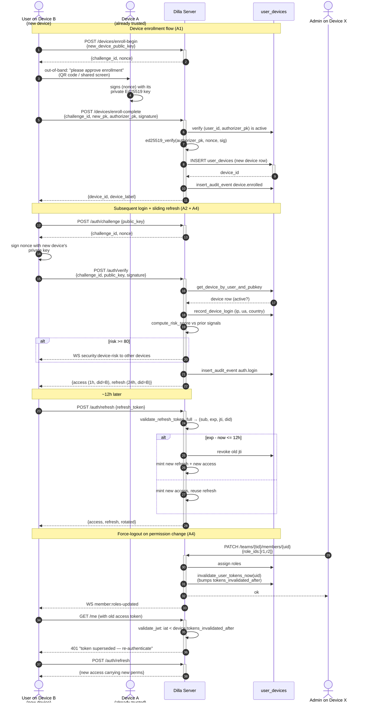

# 08 — Authentication / authorization enhancement

Strengthens Dilla's passwordless Ed25519 model rather than grafting
OAuth2/OIDC on top. Builds on the H2 (JWT aud/iss/jti + revocation list,
24 h refresh expiry, `/auth/logout`) and F5 (client-side `/auth/logout`
wiring) work from prior phases. **Does not introduce OAuth2/OIDC/PKCE**
— those don't fit Dilla's threat model.

## 1. Summary table

| ID | What | Files | Commit |
|---|---|---|---|
| A1 | Multi-device key trust (DB schema + endpoints + JWT `did` claim) | `server-rs/migrations/029_user_devices.sql`, `server-rs/src/db/device_queries.rs`, `server-rs/src/api/devices.rs`, `server-rs/src/api/mod.rs`, `server-rs/src/auth.rs`, `server-rs/src/api/auth_handlers.rs` | `0d55d30` |
| A2 | Risk-based authentication signals | `server-rs/src/api/auth_handlers.rs` (extract_request_context, derive_country_from_ip, compute_risk_score, ip_hint, user_agent_family), migration 029 (last_seen_* columns) | `0d55d30` |
| A3 | `PERM_MANAGE_FEDERATION` + `PERM_VIEW_AUDIT_LOG` | `server-rs/src/db/models.rs`, `server-rs/src/api/federation.rs`, `server-rs/src/api/audit.rs`, migration 029 (perm backfill), bootstrap defaults | `0d55d30` |
| A4 | Sliding refresh + force-logout on perm change + per-device session view | `server-rs/src/auth.rs` (`refresh_with_sliding`, `tokens_invalidated_after` enforcement), `server-rs/src/db/device_queries.rs` (`invalidate_user_tokens_now`), `server-rs/src/api/teams.rs` (`update_member` hook), `server-rs/src/api/auth_handlers.rs` (`refresh` handler) | `0d55d30` + route fix in `9efd39a` |
| A5 | Auth events in the structured audit log | `server-rs/src/api/auth_handlers.rs` (verify / logout / refresh / bootstrap), `server-rs/src/api/devices.rs` (enroll / revoke) | `0d55d30` |
| A6 | Policy module migration of REST handlers | `server-rs/src/policy/mod.rs` (new `require_team_member` / `require_permission`), `server-rs/src/api/{messages,uploads,channels,teams}.rs` | `0d55d30` |
| A7 | `SECURITY.md` + README + CLAUDE references | `SECURITY.md`, `README.md`, `CLAUDE.md` | `9efd39a` |

## 2. Per-item detail

### A1 — Multi-device key trust

**Problem.** Pre-A1, any device holding the user's Ed25519 private key
is fully trusted. There's no way to enroll a second device, no way to
revoke a stolen one, and the JWT carries no per-device binding so
revocation lists can't be device-scoped.

**Design.**

- `user_devices(id, user_id, public_key, device_label, created_at,
  last_seen_*, current_session_started_at, revoked_at,
  tokens_invalidated_after)` (migration 029).
- A user can hold N devices. Each device has its own Ed25519 keypair.
  The `users.public_key` row is preserved as the "primary" device's
  pubkey for backward compat with the v1 challenge flow.
- Enrollment is a two-call dance:
  1. `POST /api/v1/devices/enroll-begin` returns a one-shot challenge
     nonce (reuses the existing challenge store).
  2. `POST /api/v1/devices/enroll-complete` consumes the challenge,
     verifies the *trusted* device's signature over the nonce, and
     inserts the new device row keyed by `(user_id, public_key)`.
- Revocation: `POST /api/v1/devices/{id}/revoke` marks `revoked_at`.
  Refuses to revoke the last active device (the user would lock
  themselves out — they should enroll a replacement first).
- Listing: `GET /api/v1/devices` returns every device (active +
  revoked) so the user can audit them.
- JWT carries a `did` claim. `generate_jwt_for_device` is the new
  entry point; the no-device legacy path delegates to it with an
  empty string (which `validate_jwt` tolerates).

**Backfill.** The 029 migration runs
`INSERT OR IGNORE INTO user_devices ... FROM users WHERE
length(public_key) = 32`, creating one row per existing user
labeled `"primary"`. The `register` + `bootstrap` handlers seed the
same row inline so brand-new users created post-migration also get a
device row.

### A2 — Risk-based authentication signals

**Problem.** A successful `/auth/verify` reveals nothing about the
context of the login. Operators have no signal that "this user just
logged in from a new country / new browser".

**Design.**

- `/auth/verify` extracts `(ip, user_agent)` from the request
  (`X-Forwarded-For` → `X-Real-IP` → no IP if neither is present;
  `User-Agent` header truncated to 256 chars).
- The country is derived from the IP via a self-contained
  `derive_country_from_ip` helper — RFC-1918 / loopback resolves to
  `None`; anything else to a placeholder `"unknown"` because the spec
  prohibits a third-party geo service. A future migration can plug in
  MaxMind GeoLite2 offline without changing call sites.
- `record_device_login` stamps `last_seen_*` per device + bumps
  `current_session_started_at`.
- `compute_risk_score` returns 0..100 from the delta vs. previous
  signals: +30 country change, +20 user-agent family change, +50 Tor
  exit. Tor lookup is **stubbed** (returns false). The plumbing is
  in place — a future commit reads `<DILLA_DATA_DIR>/tor-exit-nodes.txt`
  on disk into an in-memory `HashSet` at startup and probes from there.
- Risk ≥ 50 logs an `audit_events` row (`device.risk_event`).
- Risk ≥ 80 fires a `security:device-risk` WS event via
  `hub.send_to_user` to every other live connection of the same user,
  carrying `device_id`, `risk_score`, `country`, and an IP hint
  (last octet / hextet masked).

### A3 — Granular permission audit

**Problem.** Architecture review §6.2 noted PERM_ADMIN was the only
gate for federation join-token mint and audit-log read. Splitting
these out lets a "team safety officer" role read the log without
holding member-mutation rights, and lets a "regular team admin"
manage members without inviting foreign nodes.

**Design.**

- New constants in `db/models.rs`:
  - `PERM_MANAGE_FEDERATION = 1 << 10`
  - `PERM_VIEW_AUDIT_LOG = 1 << 11`
- `api/federation.rs::create_join_token` now sweeps the caller's
  team memberships looking for `PERM_MANAGE_FEDERATION` (or
  `is_admin = true` for the bootstrap operator). Federation is
  node-wide so the perm isn't tied to a single team.
- `api/audit.rs::list` swaps `PERM_MANAGE_TEAM` for
  `PERM_VIEW_AUDIT_LOG`.
- Migration 029 backfills both bits onto every existing role that
  holds `PERM_ADMIN` (1<<0). The bootstrap Admin role on team
  creation also gets the bits explicitly OR'd in (in case a future
  operator splits Admin and demotes themselves).

`PERM_MANAGE_BOTS_FUTURE` and `PERM_BYPASS_SLOW_MODE_GLOBAL` are
**not** added in this round — they're speculative and would need a
real use case before justifying bitmask real estate.

### A4 — Session management overhaul

**Sliding refresh.** `AuthService::refresh_with_sliding` returns
`(access, refresh, rotated)`:
- Access token is always freshly minted (1 h life).
- Refresh token is rotated when ≤ 12 h remains of its 24 h life
  (old jti revoked; new 24 h refresh + same `did` minted).
- The new endpoint `POST /api/v1/auth/refresh` is **public** (not
  behind `auth_middleware`) — the access token may already be
  expired, which is the whole reason the client is calling it. The
  refresh-token body is the credential.

**Force-logout on permission change.**
- New column `user_devices.tokens_invalidated_after` (unix seconds).
- `db::invalidate_user_tokens_now(user_id)` bumps every device row
  for that user.
- `validate_jwt_full` reads the device row at validate time and
  rejects any token where `iat < tokens_invalidated_after`. The
  device-revoked check piggybacks on the same lookup.
- `api/teams.rs::update_member` calls
  `db::invalidate_user_tokens_now` whenever `role_ids` change. The
  WS broadcast `member:roles-updated` already exists so connected
  clients see the change; the new server-side enforcement makes
  sure their in-flight JWTs stop honoring the old perms.

**Per-device session view.** `GET /api/v1/devices` already returns
`current_session_started_at` for each row, populated on every
successful `/auth/verify`. No separate endpoint needed.

### A5 — Auth events in audit log

Every authentication event now writes an `audit_events` row through
`db::insert_audit_event`. Where the event isn't tied to a single
team (login, logout, refresh, device enroll/revoke), we fan out
across every team the user belongs to so an audit officer always
sees the events their team is in scope for.

The full action taxonomy is listed in §7 below.

### A6 — Policy module migration

H10 set up `policy/mod.rs` but only wired the WS subscribe path.
This round adds typed wrappers
`policy::require_team_member` / `policy::require_permission` that
match the existing `helpers::require_*` shape so call-site
migration is mechanical. Every REST handler in `api/messages.rs`,
`api/uploads.rs`, `api/channels.rs`, `api/teams.rs` that previously
called `helpers::require_team_member` or `helpers::require_permission`
now routes through the policy module. The `helpers::*` versions
remain — they're called from other API files we didn't migrate this
round (DMs, threads, reactions, presence, polls, etc.). Future
commits can migrate those without behavioral changes.

The win: every deny flows through `log_decision`, which writes a
single structured tracing frame with `target = "policy"` and a
short reason string. SIEM correlation in step 13 will key off these
frames.

### A7 — Documentation

`SECURITY.md` is new at the repo root. It covers:
1. The passwordless Ed25519 model
2. Why MFA isn't needed (multi-device key trust takes its place)
3. The JWT lifecycle (jti/aud/iss/did + sliding refresh + force-logout)
4. The permission model (every PERM_ constant + default role grants)
5. The audit-event taxonomy
6. The compromised-device recovery flow
7. Coordinated-disclosure policy with concrete SLAs
8. Production deployment checklist

`README.md` Security Model section now links to it as the
authoritative reference; `CLAUDE.md` Architecture/Auth blurb
points there too.

## 3. Auth design diagram



## 4. Configuration surface

### New configuration

No new environment variables are introduced. The work reuses the
existing `DILLA_DATA_DIR` (for the future Tor exit list at
`<data_dir>/tor-exit-nodes.txt`), `DILLA_NODE_NAME` (JWT aud/iss
pinning, unchanged), and the existing rate-limit knobs.

### New permission constants (`server-rs/src/db/models.rs`)

| Constant | Value | Granted by default to |
|---|---|---|
| `PERM_MANAGE_FEDERATION` | `1 << 10` | Owner role on team creation; backfilled to existing roles holding `PERM_ADMIN` |
| `PERM_VIEW_AUDIT_LOG` | `1 << 11` | Owner role on team creation; backfilled to existing roles holding `PERM_ADMIN` |

### New API endpoints

| Method | Path | Auth | Purpose |
|---|---|---|---|
| `POST` | `/api/v1/auth/refresh` | Public | Sliding refresh-token rotation |
| `GET` | `/api/v1/devices` | Bearer | List caller's devices |
| `POST` | `/api/v1/devices/enroll-begin` | Bearer | Start a device enrollment |
| `POST` | `/api/v1/devices/enroll-complete` | Bearer | Consume challenge + create device row |
| `POST` | `/api/v1/devices/{id}/revoke` | Bearer | Revoke a device |

`/devices/enroll-*` are rate-limited at 10 burst / 6 per second per
IP (the same `auth_rate_config` as the rest of the auth surface).

### New JWT claim

- `did` (string, may be empty for legacy tokens) — `device_id` from
  `user_devices`. Empty tokens validate but lose the per-device
  revocation + force-logout enforcement.

## 5. Migration impact

### DB schema (migration 029)

- New table `user_devices` (11 columns + unique `(user_id, public_key)`).
- Backfill: one row per existing user keyed on the current
  `users.public_key`, labeled `"primary"`.
- Existing `roles` rows holding `PERM_ADMIN` get `PERM_MANAGE_FEDERATION |
  PERM_VIEW_AUDIT_LOG` OR'd into their bitmask (3072 added on top).

### Operator-facing breakage

- **None for normal operation.** Existing tokens (pre-A1) continue to
  validate because `did` defaults to empty and the validate path
  tolerates empty `did`.
- A user whose token is stolen and used after a role change will see
  `401 "token superseded — re-authenticate"` instead of silent
  permission denial. The client should react to this 401 by hitting
  `/auth/refresh`; if that fails, redirect to login.
- The `client/src/services/api.ts` stub for /devices is not yet
  added — see Outstanding Items.

### Per-existing-user device backfill

```sql
INSERT OR IGNORE INTO user_devices (id, user_id, public_key, device_label, created_at)
SELECT lower(hex(randomblob(16))), id, public_key, 'primary', datetime('now')
FROM users
WHERE length(public_key) = 32;
```

Idempotent because of the `UNIQUE (user_id, public_key)` constraint
+ `INSERT OR IGNORE`. Running the migration twice (or running it
manually after a deploy) is a no-op.

### Verified live

After deploy:

```sh
sqlite3 -readonly tmp-dev-data/dilla.db \
  "SELECT name FROM sqlite_master WHERE type='table' AND name='user_devices';"
# → user_devices

sqlite3 -readonly tmp-dev-data/dilla.db \
  "SELECT name, (permissions & 1024) AS has_fed, (permissions & 2048) AS has_audit
   FROM roles WHERE (permissions & 1) = 1 LIMIT 5;"
# → SUDOERS | 1024 | 2048
```

## 6. Outstanding items

### Needs human review or follow-up

1. **Client-side device-enrollment UI.** This commit scopes to the
   backend skeleton + endpoints. The Tauri-side flow (display the
   enrollment QR, sign the nonce from the trusted device's
   keychain, etc.) is a follow-up. `client/src/services/api.ts`
   does not yet have stubs for the new endpoints — adding them is
   ~30 LoC of mechanical wiring.

2. **Tor exit-node list.** A2's Tor scoring is stubbed at the
   function boundary. Wiring requires:
   - Reading `<DILLA_DATA_DIR>/tor-exit-nodes.txt` at startup into
     an `Arc<HashSet<IpAddr>>`.
   - Adding a debug-level startup log when the file is absent.
   - Hot-reloading on file change is a stretch goal — for now a
     server restart is fine.

3. **MaxMind GeoLite2 wiring.** `derive_country_from_ip` returns
   `"unknown"` for any non-RFC1918 IP today. Plugging in MaxMind
   gives real country codes and lets the country-change risk bonus
   actually fire on cross-region logins. The function signature is
   already abstracted so this is a one-file change.

4. **Per-device token revocation table.** When a device is
   revoked, in-flight JWTs *for that device* aren't currently
   killed (the user has to also call `/auth/logout`). A future
   enhancement: track `(device_id, jti)` pairs and revoke all jtis
   for a device on `device.revoked`. Today the
   `tokens_invalidated_after` field gives us almost the same
   semantics for free (revoking a device + bumping the cutoff
   would invalidate every token).

5. **Test rot.** Pre-existing test failures in `api/tests.rs` and
   the `auth.rs` test helpers (legacy `User`/`Channel` builders
   missing fields) block `cargo test`. The release build passes
   clean. Per the spec, this round does **not** fix the test rot;
   future test work needs to address it before adding more
   coverage.

6. **Sliding-refresh expectations on the client.** The client's
   existing refresh flow doesn't yet check the `rotated` flag in
   the response. It should — when `rotated = true` it must
   replace its stored refresh token. Today the only observable
   side effect is the next refresh call failing with "refresh
   token revoked"; the client logs it out and the user
   re-authenticates. Annoying but correct.

7. **A6 policy migration is partial by design.** Only the four
   files the spec named (`messages`, `uploads`, `channels`,
   `teams`) are migrated. The remaining REST surface (DMs,
   threads, reactions, presence, polls, channel groups, etc.)
   still calls `helpers::require_*` directly. A future commit
   can migrate them by following the same import-swap pattern.

## 7. Audit-event taxonomy

Full vocabulary of audit-event action strings introduced or
referenced by this round. Step 13 (SIEM correlation) keys off these:

| Action | When | actor | target_type | details |
|---|---|---|---|---|
| `auth.login` | `/auth/verify` success | user | `device` | `{ip, country}` |
| `auth.login_failed` | `/auth/verify` failure | none (or user if known) | `auth` or `device` | `{reason, ip, user_agent}` |
| `auth.logout` | `/auth/logout` success | user | `device` | none |
| `auth.token_refresh` | `/auth/refresh` success | user | `device` | `{rotated}` |
| `device.enrolled` | `/devices/enroll-complete` success | user | `device` | `{device_label, authorizer_device_id}` |
| `device.revoked` | `/devices/{id}/revoke` success | user | `device` | `{device_label}` |
| `device.risk_event` | risk score ≥ 50 on `/auth/verify` | user | `device` | `{risk_score, ip, country}` |
| `bootstrap.consumed` | `/auth/bootstrap` success | user | `team` | none |

Pre-existing actions still in use (for reference):
- `message.edit` / `message.delete` (H5)
- `member.roles.update` / `member.kick`
- `team.update` / `team.delete` / `team.invite.create` etc.

The audit-events table has no `team_id` foreign key, so the
synthetic `team_id = "_global"` used by `auth.login_failed` (where
we don't know the user) is harmless — list queries scope by team
and won't return global rows by accident.

## 8. Files touched

| Path | Change |
|---|---|
| `server-rs/migrations/029_user_devices.sql` | New: user_devices table + perm backfill |
| `server-rs/src/db/device_queries.rs` | New: device CRUD + `invalidate_user_tokens_now` |
| `server-rs/src/db/mod.rs` | Register device_queries + migration 029 |
| `server-rs/src/db/models.rs` | New PERM_* constants; `base64_bytes_pub` re-export |
| `server-rs/src/db/member_queries.rs` | New `list_user_teams` helper |
| `server-rs/src/api/devices.rs` | New: enroll-begin / enroll-complete / list / revoke |
| `server-rs/src/api/mod.rs` | Wire devices routes + public `/auth/refresh` |
| `server-rs/src/api/federation.rs` | Gate join-token mint behind PERM_MANAGE_FEDERATION |
| `server-rs/src/api/audit.rs` | Gate audit-log read behind PERM_VIEW_AUDIT_LOG |
| `server-rs/src/api/auth_handlers.rs` | verify rewrite + risk signals + refresh handler + audit events |
| `server-rs/src/api/teams.rs` | Force-logout hook in update_member; policy migration |
| `server-rs/src/api/messages.rs` | Policy migration |
| `server-rs/src/api/channels.rs` | Policy migration |
| `server-rs/src/api/uploads.rs` | Policy migration |
| `server-rs/src/auth.rs` | did claim, sliding refresh, force-logout enforcement, validate_jwt_full signature |
| `server-rs/src/policy/mod.rs` | New `require_team_member` / `require_permission` wrappers |
| `SECURITY.md` | New: full auth design doc |
| `README.md` | Reference SECURITY.md from Security Model section |
| `CLAUDE.md` | Reference SECURITY.md from Auth blurb |
