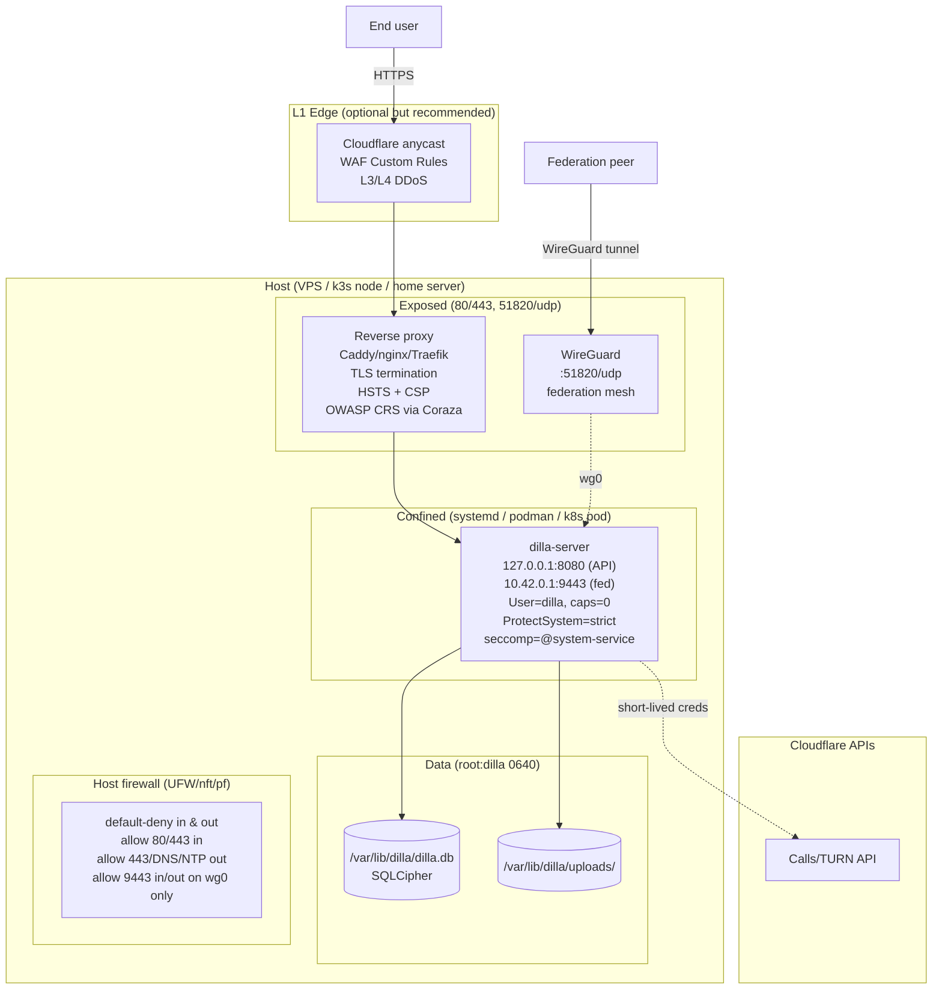

# 09 — Infrastructure security playbook

Step-9 output. Companion to:
- `03-architecture-review.md` §9 (network segmentation), §13 (rec summary)
- `05-backend-hardening.md` H1, H4, H12 (rate limits, WS quota, upload quota)
- `08-auth-enhancement.md` §4 (config surface), §7 (audit-event taxonomy)

Scope: **deployment hardening** for self-hosted operators (home server,
single VPS, k3s cluster, federated multi-region). NOT cloud-WAF rollout
inside an AWS/GCP account Dilla does not have.

---

## 1. Summary

A new `deploy/` tree ships every artifact a self-hosted operator needs to
run Dilla securely on top of the controls already in the binary:

- Three drop-in reverse-proxy configs (Caddy, nginx, Traefik) with TLS,
  HSTS, CSP, WebSocket passthrough, gzip/HTTP3.
- A hardened Docker Compose stack + a federation overlay.
- A production systemd unit with full sandboxing + a per-directive rationale
  doc.
- Kubernetes NetworkPolicy + PodSecurity (`restricted` profile) reference.
- UFW / nftables / iptables / pf firewall rule-sets.
- OWASP CRS rules for Coraza-Caddy + Cloudflare WAF Custom Rules.
- WireGuard mesh template for federation overlay.
- Detection guide (audit_events queries + LogQL) — no IDS appliance, just
  the OSS toolchain.
- Cloudflare TURN operational hygiene.
- Layered DDoS posture + load-shedding playbook.

Total new files: 18. Zero changes to Rust/TypeScript source.

---

## 2. File index

| Path | Item | Purpose |
|---|---|---|
| `deploy/reverse-proxy/Caddyfile` | I1 | Caddy v2.7 reference, auto-TLS, full security headers, WS passthrough |
| `deploy/reverse-proxy/nginx.conf` | I1 | nginx 1.24+ reference, manual TLS, rate-limit zones, WebSocket upgrade |
| `deploy/reverse-proxy/traefik.static.yml` | I1 | Traefik v3 entrypoints + ACME |
| `deploy/reverse-proxy/traefik.dynamic.yml` | I1 | Traefik routers + middlewares with the same header set |
| `deploy/docker/compose.yml` | I2 | Hardened Compose stack: read-only rootfs, dropped caps, loopback bind, secrets via files |
| `deploy/docker/compose.federation.yml` | I2/I7 | Federation overlay; binds federation listener on the WG mesh IP |
| `deploy/docker/.env.example` | I2 | Operator-facing env-var template |
| `deploy/systemd/dilla-server.service` | I3 | Production systemd unit: `LoadCredential`, `ProtectSystem=strict`, empty `CapabilityBoundingSet`, seccomp filter |
| `deploy/systemd/HARDENING.md` | I3 | Per-directive rationale and known limits |
| `deploy/k8s/networkpolicy.yaml` | I4 | Deny-all egress + selective allow for DNS, Cloudflare TURN, OTel, federation, Giphy |
| `deploy/k8s/podsecurity.yaml` | I4 | `restricted` PSS namespace + Pod template with full securityContext |
| `deploy/firewall/ufw.sh` | I5 | Debian/Ubuntu UFW rules, default-deny egress |
| `deploy/firewall/nftables.conf` | I5 | nftables equivalent with brute-force set |
| `deploy/firewall/iptables.rules` | I5 | Legacy iptables-restore format |
| `deploy/firewall/pf.conf` | I5 | FreeBSD / OpenBSD / macOS pf |
| `deploy/waf/caddy-crs.snippet` | I6 | OWASP CRS via Coraza-Caddy + Dilla-specific exclusions for `/ws`, `/upload`, `/auth/challenge` |
| `deploy/waf/cloudflare-waf.json` | I6 | Cloudflare WAF Custom Rules: block scanner paths, rate-limit auth + prekey lookup, block oversized bodies |
| `deploy/federation/wireguard.example.conf` | I7 | WG hub + peer template; documents the dual-NIC bind story |
| `deploy/detection/README.md` | I8 | What to alert on (failed-auth bursts, fed-peer volume, OTPK drain, DB growth) + LogQL/SQL snippets |
| `deploy/turn/README.md` | I9 | Cloudflare TURN token scope, secret storage, abuse response |
| `deploy/ddos/README.md` | I10 | L1-L4 layered defense; documents the load-shedding ladder |

---

## 3. Recommended deployment topology

---

## 4. Operator decision matrix

Pick the artifacts you need per deployment style. Everything else is optional
but encouraged.

### (a) Home server (single user / family / small team, ~5 users)

Threat model: drive-by scanners, opportunistic exploitation. Not a targeted
actor.

| Artifact | Verdict |
|---|---|
| I1 Caddyfile | **Required.** Auto-TLS + sane defaults. |
| I2 Compose | **Required.** Simplest install path. |
| I3 systemd | Skip (Compose covers it) unless you're a systemd person. |
| I4 k8s | N/A. |
| I5 UFW | **Required.** Default-deny on the LAN-facing iface. |
| I6 WAF | Cloudflare WAF JSON optional; CRS is overkill at this scale. |
| I7 WireGuard | Skip (no federation). |
| I8 Detection | Light version — `journalctl` + the SQL snippets only. |
| I9 TURN doc | Required if voice is enabled. |
| I10 DDoS | Read once; Cloudflare proxy in front is enough. |

### (b) Single-VPS (small community, 10-100 users)

Threat model: scanners + some targeted reconnaissance + the occasional
abusive user.

| Artifact | Verdict |
|---|---|
| I1 Caddyfile / nginx | **Required.** Pick one. |
| I2 Compose | **Required.** |
| I3 systemd | Required if you run native (no Docker). |
| I4 k8s | N/A. |
| I5 UFW or nftables | **Required.** Default-deny both directions. |
| I6 WAF | **Cloudflare WAF JSON required.** CRS optional. |
| I7 WireGuard | Skip unless federating. |
| I8 Detection | **Required.** Set up Loki + Grafana + Promtail. |
| I9 TURN doc | **Required.** Set the cost ceiling. |
| I10 DDoS | **Required reading.** Decide on the load-shed ladder. |

### (c) k3s cluster (multi-tenant org, 100+ users)

Threat model: as above, plus insider risk + supply chain exposure of cluster
operators.

| Artifact | Verdict |
|---|---|
| I1 Traefik dynamic/static (or ingress-nginx) | **Required.** |
| I2 Compose | Skip; you're on k8s. |
| I3 systemd | Skip. |
| I4 NetworkPolicy + PodSecurity | **Required.** Enforce the restricted PSS. |
| I5 nftables (on the node) | **Required.** Belt-and-braces under the CNI. |
| I6 Both | **Required.** CRS at ingress + Cloudflare at edge. |
| I7 WireGuard | Optional — if federating cross-cluster, recommended. |
| I8 Detection | **Required.** Loki + Tempo + Prometheus + Grafana stack. |
| I9 TURN doc | **Required.** Per-team monitoring matters at this scale. |
| I10 DDoS | **Required.** |

### (d) Multi-region federation (org with 2+ nodes in different DCs/regions)

Threat model: targeted compromise of any single peer can poison the mesh.

| Artifact | Verdict |
|---|---|
| I1 | Required on every node. |
| I2 + compose.federation.yml | **Required.** |
| I3 | Required if native. |
| I4 | Required if any node is on k8s. |
| I5 | **Required.** Mesh CIDR is the only allowed federation source. |
| I6 | **Required.** Both layers. |
| I7 WireGuard | **Required.** This is the whole reason it exists. |
| I8 Detection | **Required.** Per-peer volume anomaly alerting is the federation early-warning. |
| I9 | Required. |
| I10 | Required. |

---

## 5. Open items (need code, not config)

| # | Item | Why |
|---|---|---|
| O-1 | Add `DILLA_OVERLOAD_BANNER` config + plumb to `/api/v1/health` payload | Documented in I10 load-shed ladder; not yet implemented. ~30 LoC server + ~20 LoC client banner. |
| O-2 | Add `DILLA_CF_TURN_API_TOKEN_FILE` (file fallback for the Cloudflare token, mirroring `DILLA_DB_PASSPHRASE_FILE`) | Documented in I9 secret-storage section; only the DB passphrase has the `_FILE` variant today. |
| O-3 | Consider consolidating `DILLA_FED_BIND_ADDR` + `DILLA_FEDERATION_PORT` into a single `DILLA_FEDERATION_BIND="ip:port"` for parity with `DILLA_API_BIND`-style naming | Optional ergonomic; the existing pair works. The prompt referenced `DILLA_FEDERATION_BIND` which does not exist — recommendation documented but skipped per scope. |
| O-4 | Expose a `/healthz` + `/readyz` distinction | k8s PodSecurity reference uses both; today's server only has `/api/v1/health`. ~10 LoC. |
| O-5 | Add a `voice_disabled` flag on `teams` for the I9 abuse-response playbook | Currently you'd have to delete voice channels manually. ~20 LoC + migration. |
| O-6 | Surface a `--healthcheck` subcommand for Docker `HEALTHCHECK` directive | The Compose stack references `dilla-server --healthcheck`; binary needs to grow it. ~15 LoC. |
| O-7 | Audit `audit_events` schema for the `target_user_id` field used in I8's OTPK-drain query | Per `08-auth-enhancement.md §7` the schema stores `details` as JSON; the I8 query assumes `$.target_user_id` — confirm the prekey-consume action writes this key. |

None of O-1..O-7 are blockers for following 09. They're follow-ups that
sharpen what's documented.

---

## 6. Cross-references

| Step | What it gives you | How 09 uses it |
|---|---|---|
| Step 4 (`04-critical-fixes`) R-01 | Server refuses non-TLS bind without `DILLA_INSECURE` | Step 9's reverse-proxy configs set `DILLA_INSECURE=true` because TLS is delegated upstream. The fix and the deployment story interlock. |
| Step 4 R-06 | Bootstrap token to file, 15-min expiry | I8 detection includes a `bootstrap.consumed` audit-event alert. |
| Step 5 H1 (`05-backend-hardening`) | `tower_governor` rate limiter w/ `DILLA_RATELIMIT_*` env | I10 references the env-var ladder for load shedding. |
| Step 5 H4 | WS subscription cap per client | I10 documents this as the L3 control. |
| Step 5 H12 | Per-team upload quota `DILLA_UPLOAD_QUOTA_PER_TEAM_GB` | I10 lists this; I8 #3 (DB-growth) alert depends on it firing. |
| Step 5 H14 | `DILLA_TRUSTED_PROXIES` honored | I1 reverse-proxy configs set `X-Forwarded-For`; Compose sets `DILLA_TRUSTED_PROXIES=172.20.0.0/16`. |
| Step 8 (`08-auth-enhancement`) §4 | New `/devices` endpoints, JWT `did` claim | I6 WAF rate-limits cover `/devices/*` alongside `/auth/*`. |
| Step 8 §7 | Full audit-event vocabulary | I8 detection queries key off these action strings — the contract is exactly as documented in §7. |

---

Operators who follow 09 inherit every control listed in steps 4-8 by
default. The reverse proxy enforces TLS, the systemd unit enforces process
isolation, the firewall enforces network segmentation, the WAFs enforce
input sanitization, and the detection guide tells them what to alert on.
Nothing in this step blocks shipping a 1.0 — it's all opt-in deployment
hardening that operators can adopt incrementally.
